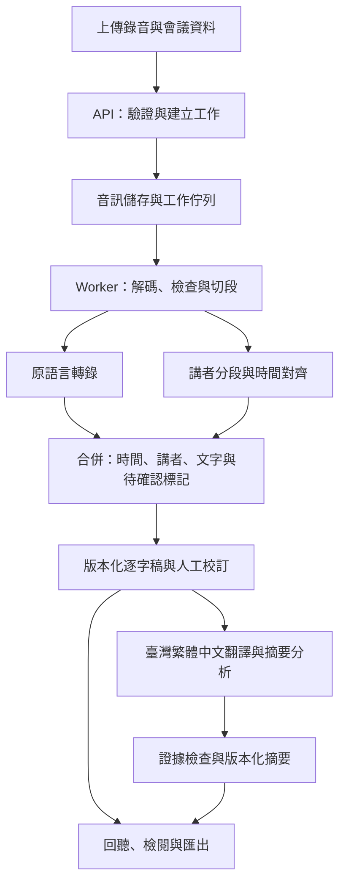

# AI Meet in Multi-Language

將含中文（暫指華語）、英語、日語、臺語的會議錄音，轉成可校訂、可回聽的逐字稿，以及可追溯來源的會議摘要與分析。

狀態：P1 品質原型開發中，尚未完成模型品質驗證。更新日期：2026-09-12。

## 目前進度：P1 品質原型

已建立第一個可執行骨架：FastAPI Web 頁面可上傳短音檔並呼叫候選轉錄模型，轉錄工作與標準化結果保存在本機 `var/`；命令列工具可將長錄音轉為 16 kHz 單聲道、切成有原檔時間偏移的片段，並計算 CER／WER。這是評測工具，尚未包含摘要、完整長音檔自動合併或正式使用者系統。

需求：Python 3.12、[uv](https://docs.astral.sh/uv/)、FFmpeg，以及可用的 `OPENAI_API_KEY`。金鑰只設定於伺服器環境，不放入瀏覽器或 Git。

```bash
uv sync
export OPENAI_API_KEY='你的 API 金鑰'
uv run uvicorn meet_in_multi_language.api:app --reload
```

開啟 `http://127.0.0.1:8000`。目前依 Transcriptions API 的直接上傳限制，Web 原型接受最大 25 MB；完整會議先用下列指令切段：

```bash
uv run meet-eval prepare /path/to/meeting.mp3 ./var/eval/meeting
uv run meet-eval transcribe ./var/eval/meeting/manifest.json ./var/results \
  --engine gpt-4o-transcribe-diarize
uv run meet-eval score reference.txt hypothesis.txt --unit character
```

整批轉錄每完成一段就寫入 `parts/`；中途失敗後重跑會沿用已完成片段，加入 `--force` 才全部重做。合併結果的時間會換算回原始會議時間軸。評測資料、錄音、金鑰及執行結果都在 `.gitignore` 排除範圍內。

## 1. 需求與暫定範圍

已確認：輸入為會議錄音，需要逐字稿及摘要分析，講者會混用中、英、日、臺語。同一位講者、甚至同一句話內都可能切換語言。操作使用 Web 介面；第一版上傳錄音後於會後處理，允許雲端 API、優先驗證品質。臺語保留漢字，另附臺灣繁體中文譯文。介面與所有衍生內容使用臺灣通用的繁體中文（`zh-TW`）及臺灣慣用詞彙。

下表區分已確認需求與規劃假設；暫定項目不是已接受的產品限制。

| 項目 | 暫定設計 | 影響 |
| --- | --- | --- |
| 使用方式（已確認） | 上傳錄音，會後處理 | 即時字幕列為後續擴充 |
| 介面（已確認） | Web 介面；使用臺灣繁體中文（`zh-TW`） | 個人／團隊規模待確認 |
| 模型部署（已確認） | 允許雲端 API，優先驗證品質 | Web／後端實際託管位置待定 |
| 逐字稿 | 保留原語言，可另看臺灣繁體中文譯文 | 翻譯不覆蓋原文 |
| 臺語書寫（已確認） | 保留臺語漢字，另附臺灣繁體中文譯文 | 評測需統一漢字異體／用字規範 |
| 摘要語言（已確認） | 臺灣繁體中文及臺灣慣用詞彙 | 後續可增加其他輸出語言 |
| MVP 容量目標 | 每場最長 120 分鐘、最多 8 位講者、單檔 500 MB | 是待驗證的產品目標，不是模型限制或現有效能 |
| 錄音來源 | 首版處理一個檔案，保留原聲道資訊 | 分軌會議錄音可於後續加強 |

首版包含：錄音上傳、背景處理、講者分段、混語逐字稿、人工校訂、臺灣繁體中文摘要、決議與待辦、來源回查、匯出與刪除。

首版不納入：會議機器人加入 Teams／Zoom、即時口譯、跨會議問答、自動寄送紀錄、自動建立外部任務、聲紋身分辨識與情緒／人格推論。

## 2. 使用流程與交付內容

1. 建立會議，填入名稱、日期／時區，選填議程、參與者及專有名詞。
2. 上傳 WAV、MP3 或 M4A；系統檢查實際格式、大小、長度及是否可解碼。
3. 顯示排隊、音訊處理、轉錄、摘要等階段，允許取消及失敗後重試。
4. 檢視原語言逐字稿；點選時間即可回聽，篩選講者及待確認段落。
5. 校訂文字、時間與講者名稱；保存修訂版本。
6. 檢視自動摘要草稿，必要時依校訂稿重新產生，人工確認後標示為已確認。
7. 匯出逐字稿與摘要，或刪除整場會議資料。

| 產物 | 必備內容 |
| --- | --- |
| 原語言逐字稿 | 段落起迄時間、講者、文字、可能的多語標籤、待確認標記 |
| 臺灣繁體中文譯文 | 對應原段落，明確標示為翻譯；可關閉 |
| 重點摘要 | 精簡總覽、各議題重點及原文引用 |
| 決議 | 已明確同意的事項、相關條件及來源；區分提案、定案、撤回 |
| 待辦事項 | 任務、負責人、期限、來源；未提及者保留空值並顯示「未指定」 |
| 分析 | 未解問題、明示風險、分歧及待確認事項；模型推論須另行標示 |
| 匯出 | 逐字稿 TXT／SRT、摘要 Markdown、完整資料 JSON |

SRT 以原語言為預設，字幕含講者標籤；重疊發言的轉錄資料仍保留各自時間，匯出時明確標記重疊。

### Web 畫面規劃

| 畫面 | 操作與內容 |
| --- | --- |
| 會議列表 | 建立會議、查看處理／審核狀態、搜尋會議名稱、開啟與刪除 |
| 建立／上傳 | 拖放或選擇錄音，輸入標題、會議時間／時區，選填詞彙表與參與者；顯示格式／容量限制 |
| 處理進度 | 顯示目前階段、已處理片段數、錯誤原因及取消／重試；無可靠估算時不虛構百分比或剩餘時間 |
| 會議工作區 | 固定音訊播放器；以分頁切換逐字稿、摘要分析，保留播放位置 |
| 逐字稿分頁 | 時間戳、講者與原文；對照臺灣繁體中文譯文、講者改名、文字校訂、待確認篩選與版本提示 |
| 摘要分析分頁 | 總覽、議題、決議、待辦、未解問題；點擊引用跳到逐字稿並定位音訊，支援重生草稿與人工確認 |

桌面版優先支援原文／譯文並排檢閱，小螢幕改為上下排列。長逐字稿採分批載入；播放、跳轉與編輯可透過鍵盤操作。尚未產生、處理失敗及部分結果都須有明確畫面。

## 3. 逐字稿與混語規則

- 原語言稿以忠實逐字為目標，保留否定、重複、自我更正及會影響語意的語助詞；可補標點，不自動潤飾成另一種說法。整理版或翻譯另存。
- 語言是段落／片語的屬性，不是講者的固定屬性；同一講者換語言時仍維持原講者 ID。無法判定語言時標為 unknown，允許同段多種語言。
- 中文字形統一為臺灣繁體中文。介面、翻譯、摘要、分析、提示與匯出說明使用「軟體、硬體、網路、伺服器、資料、資訊、影片、品質」等臺灣慣用詞彙，避免簡體字及中國地區慣用詞彙。
- 英語與日語保留原文及專有名詞；臺語採漢字原稿與臺灣繁體中文譯文對照，轉換或校訂需保留原始結果與版本。臺語漢字原稿保留臺語用詞與語序。
- 忠實逐字稿不改寫講者實際使用的詞義。若講者說出中國慣用詞，逐字稿以繁體字忠實記錄；翻譯、摘要與分析則改用語意相同的臺灣慣用詞。原文引用不得為了在地化而扭曲內容。
- 聽不清楚、重疊發言、疑似專有名詞錯誤均可標記，不靠摘要模型推測補完。模型沒有標記，不代表辨識正確。
- 公司、人名、產品名可提供詞彙表輔助辨識；不同模型若不支援提示，轉接層應明確反映能力限制。
- 講者先使用 A、B、C 等匿名標籤，再由使用者對應姓名；參與者名單本身不足以推定聲音與姓名的關係。
- 長音檔以停頓及供應商大小／長度限制切段，保留短重疊上下文、原檔時間偏移，再合併去重。不得刪掉靜音後直接把壓縮時間當作原時間。
- 若各段獨立做講者辨識，需另做跨段講者對應；無法可靠對應時保留待確認標記，不直接把不同區塊的 speaker A 視為同一人。
- 音訊保留原檔；降噪、重採樣等衍生處理先做對照評測，不預設全部啟用。已有分離聲道不得無條件混成單聲道。

臺語品質是產品的核心驗證項目。「支援中文／多語」不等於已驗證臺語混語品質；原語言轉錄與翻譯也必須分別驗收。

## 4. 摘要分析規則

摘要以指定版本的逐字稿為依據，每個可驗證的事實、決議及待辦都保存來源段落 ID。使用者可由摘要跳到逐字稿與錄音。

- 區分「有人提出」與「會議同意」，追蹤後續否決、修正與撤回，不只擷取關鍵字。
- 負責人、日期、金額與數量必須有依據，不因為某人發言就認定他負責。
- 「下週五」保存原說法；只有會議日期／時區已知且語意明確時才另存解析後日期。
- 長會議採分段抽取證據，再跨段整合；最終核對仍讀取原文證據與必要上下文，不能只依賴分段摘要。
- 含待確認原文的結論也標記待確認；找不到依據的內容不得列為已定案事實。
- 逐字稿修訂後，舊摘要顯示「來源已更新」，保留舊版本並可重新產生。
- 上傳內容與逐字稿一律當作資料處理，其中的指令不得改寫摘要規則或觸發外部操作。

例：若原文是「可以考慮下週上線，但測試還沒過」，結果應是「上線時程待定，測試尚未通過」，不能產生「決議下週上線」。

## 5. 建議架構

先採單一應用 API 搭配獨立背景 worker。轉錄屬長時間工作，避免綁在一次網頁 HTTP 請求；原始音訊、文字版本與工作狀態分開保存。



轉錄與講者分段都以音訊為輸入。兩者可由同一模型一次完成，或由不同元件完成後對齊；圖示為邏輯職責，不代表必須重複呼叫兩個模型。詞級時間戳先列為選配，MVP 要求段落級回聽。

技術方向暫定為 Python 處理後端／音訊工作、TypeScript 建置 Web 介面、關聯式資料庫保存會議與版本、檔案或物件儲存保存音訊。以後端串接雲端 API，瀏覽器不直接持有模型金鑰；框架、佇列實作與版本於品質原型及託管環境確認後定案。首版無需向量資料庫。

轉接層分為 `Transcriber`、`Diarizer`、`Translator`、`Summarizer`、`AudioStore`，統一輸入輸出，但保留各模型對語言、提示、時間戳與講者標記的能力差異。

### 執行模型的選擇方式

本節是產品執行時的模型候選，與下方 Codex 開發用模型分開決策。已確認優先使用雲端 API 驗證品質；先比較混語轉錄、講者分段、延遲、每小時錄音成本及人工校訂時間，再選定組合。

| 路線 | 原型內容 | 定案前需確認 |
| --- | --- | --- |
| 雲端轉錄 | 可用 `gpt-transcribe` 作為混語轉錄候選 | 臺語品質、實際帳號可用性、時間對齊方式 |
| 雲端含講者 | 可用 `gpt-4o-transcribe-diarize` 作為整合方案候選 | 混語準確度、跨切段講者一致性、提示限制 |

全本機部署保留為後續選項，不列入本次 MVP 的必要比較；若雲端臺語品質不足，再評估臺語專用模型作補強。

官方文件說明 `gpt-transcribe` 支援多語與關鍵詞提示；這是列入候選的依據，不是本專案的臺語準確度保證。[模型文件](https://developers.openai.com/api/docs/models/gpt-transcribe)

目前 OpenAI 文件指出：上傳檔案上限為 25 MB；diarize 的 `diarized_json` 提供講者及段落起迄時間，超過 30 秒需設定切段策略，且不支援 prompt；`timestamp_granularities[]` 僅適用 `whisper-1`。應用需依實際模型適配切段與對齊。不能把模型支援的 `zh-tw` 當作已證實支援臺語的依據。[轉錄指南](https://developers.openai.com/api/docs/guides/speech-to-text)

以上於 2026-09-12 查核；實作串接前重新確認 API 契約。摘要模型於同一套真實逐字稿上比較事實正確性、引用及成本，暫不鎖定供應商。尚未進行付費呼叫或上傳會議內容。

## 6. 核心資料與 API 草案

| 資料 | 核心欄位／規則 |
| --- | --- |
| Meeting | ID、擁有者、標題、開始時間／時區（可未知）、詞彙表、保存期限 |
| AudioAsset | 會議 ID、原檔／衍生檔位置、雜湊、時長、聲道、切段原時間偏移 |
| Job | 會議 ID、階段、嘗試次數、輸入版本、模型／設定、錯誤、耗時及用量 |
| Speaker | 會議內 ID、匿名標籤、人工姓名對應；不跨會議追蹤身分 |
| TranscriptRevision | 不可變版本 ID、父版本、作者、時間、處理／校訂來源 |
| Segment | 版本 ID、段落 ID、start_ms／end_ms、speaker_id、多語標籤、原文、品質標記 |
| Translation | 來源版本／段落、目標語言、譯文、模型及版本 |
| AnalysisRevision | 來源逐字稿版本、總覽、議題、決議、待辦、未解問題、審核狀態 |
| Evidence | 分析項目 ID、來源版本與段落 ID、引用文字；起迄時間由來源解析 |

模型信心分數若不可取得就留空；不同來源的分數不直接比較，不以文字模型自評冒充辨識可信度。待確認標記可來自重疊發言、對齊失敗、缺失時間戳、模型差異或人工檢閱。

API 路由為設計草案，尚未實作：

| 方法與路徑 | 用途 |
| --- | --- |
| `POST /meetings` | 建立會議資料 |
| `POST /meetings/{id}/audio` | 上傳並驗證錄音 |
| `POST /meetings/{id}/jobs` | 啟動指定處理階段，接受冪等鍵與輸入版本 |
| `GET /jobs/{id}` | 取得階段、進度、錯誤與用量 |
| `POST /jobs/{id}/cancel` | 請求取消；不承諾已送供應商的工作可立即取消 |
| `GET /meetings/{id}/transcript` | 取得指定或最新逐字稿版本 |
| `PATCH /meetings/{id}/transcript` | 搭配基準版本提交校訂，衝突時拒絕覆寫 |
| `GET /meetings/{id}/analysis` | 取得摘要及來源版本／是否過期 |
| `PATCH /meetings/{id}/analysis` | 依基準版本保存人工校訂或確認狀態，保留修改歷程 |
| `GET /meetings/{id}/audio` | 經授權回聽原音訊，支援區段讀取 |
| `GET /meetings/{id}/exports` | 指定格式與版本匯出 |
| `DELETE /meetings/{id}` | 啟動錄音、衍生檔、文字與匯出的刪除工作 |

工作主流程為 `queued → preprocessing → transcribing → analyzing → completed`，另有 `failed`、`cancel_requested`、`cancelled`。人工審核狀態與工作狀態分開；完成計算不代表已經人工確認。缺失轉錄片段時標示部分結果，不把不完整摘要顯示為完整紀錄。

每階段保存檢查點；暫時性失敗以有上限的退避重試，永久格式錯誤直接回報。重跑優先重用已完成且輸入／設定相同的結果；供應商已收到但回應遺失時仍可能重複計費，需記錄請求 ID 與累積預算。

## 7. 資料保存與操作設計

- 上傳頁明示音訊／文字將送往所選雲端 API 處理，以及保存方式。
- API 金鑰僅留後端，日誌預設記錄工作 ID、錯誤碼與耗時，不寫入完整錄音、逐字稿或憑證。
- MVP 單人本機版綁定本機介面；若開放團隊或遠端使用，所有會議、音檔與匯出路由都驗證登入及會議存取權限。
- 錄音、衍生音檔、逐字稿與摘要可設定保存期限，具體天數待確認；上線前必須有明確預設值。
- 刪除時先停用存取並取消工作，再清理各產物，避免 worker 完成後把資料寫回。備份與供應商留存依實際部署政策說明，不能承諾刪除本機即同步刪除所有外部副本。
- 每場會議記錄各階段耗時、重試與模型用量；顯示估計成本與實際成本的差異，預算上限於模型方案定案時設定。

## 8. 品質驗證與驗收門檻

先建立人工對照集，再選模型。第一輪目標為至少 60 分鐘、12 段以上代表性錄音，包含各語言純語片段、華臺混用、中英混用、中日混用、同一句多語、專有名詞、重疊發言與背景噪音。臺語及混語片段各至少涵蓋 15 分鐘，可相互重疊；另需至少一場完整長會議驗證跨段一致性。

調整提示／詞彙表的開發集與驗收集按會議分開，不把同一錄音的相鄰片段分到兩邊。臺語與日語參考稿需由熟悉該語言的人員校訂；決議及待辦標註需保留否定、條件、撤回與來源。

以下是初始工程目標，不是已量測成績。完成原型後依真實用途確認；任何修改需記錄理由，不能用總體平均掩蓋臺語失敗。

| 項目 | 量測與初始目標 |
| --- | --- |
| 中文／日語 | 各自字元錯誤率 CER ≤ 15%，固定文字正規化規則 |
| 英語 | 詞錯誤率 WER ≤ 15% |
| 臺語 | 依漢字用字／異體正規化規範計算 CER，初始目標 ≤ 25%；另人工檢查語意與關鍵詞 |
| 臺灣繁體中文譯文 | 臺語原文與譯文逐段對照；驗收樣本中的否定、數字、人物與條件不得反轉或新增 |
| 混語 | 單獨報告語言切換附近的漏字、錯譯、語言替換；關鍵人名／數字／否定詞正確率 ≥ 95% |
| 講者與時間 | 非重疊段落 DER ≤ 15%（容許邊界 250 ms）；重疊段落另外報告，不能排除後宣稱整體達標；95% 抽查段落邊界誤差 ≤ 2 秒 |
| 摘要證據 | 決議／待辦引用 ID 有效率 100%；人工檢查引用支持其敘述的比例 ≥ 95% |
| 摘要完整性 | 人工標註的重要決議／待辦召回率 ≥ 90%；驗收集不容許捏造負責人、期限或已定案結論 |
| 可用性 | 逐字稿可校訂、講者可改名、來源可回聽、匯出可重開；修訂後可識別過期摘要 |
| 失敗處理 | 超限／損壞／無語音檔有明確結果；重試不覆蓋人工版本；刪除後工作不得重新建立資料 |
| 效能／成本 | 分別記錄每小時錄音費用、處理時間／音檔時長比及人工校訂時間；依部署硬體與預算定門檻 |

字詞錯誤率使用 `(替換 + 刪除 + 插入) / 參考字詞數`；中文／日語／臺語漢字採字元、英語採詞，臺語先約定漢字書寫規則。DER 是講者分段錯誤率。小型對照集只作原型判斷，上線前需擴充不同講者、錄音設備及場景。

臺語或混語不達標時，先試詞彙、切段與另一轉錄候選，再評估臺語專用模型；保留人工校訂流程。在達到門檻前，不宣稱四語皆可可靠自動處理，也不直接以翻譯取代臺語原稿來達標。

## 9. 開發階段與完成條件

| 階段 | 工作產物 | 進入下一階段的條件 |
| --- | --- | --- |
| P0：需求與樣本 | Web、會後上傳、雲端 API、臺語漢字加臺灣繁體中文譯文已確認；補充容量／預算，建立標註規範與樣本清單 | 取得可測試的錄音與人工對照，明確列出驗收目標 |
| P1：品質原型 | 建立離線評測流程，比較至少兩種可行轉錄方案及摘要候選，產出品質／成本報告 | 臺語、混語、講者與摘要有可重現數據；選定方案或提出缺口 |
| P2：處理核心 | 音訊接收、背景工作、切段合併、版本化逐字稿、摘要證據、JSON／文字匯出 | 一場完整會議端到端可重跑；失敗可恢復，原文可追溯 |
| P3：檢閱介面 | 上傳／進度、同步回聽、校訂／講者命名、摘要檢閱、字幕匯出 | 使用者能完成上傳到確認匯出的完整流程 |
| P4：試用驗收 | 真實會議回歸測試、存取／刪除測試、成本與效能量測、部署說明 | 達到商定驗收門檻，已知限制明示後開始小範圍使用 |

先排工作依賴，不預設工期；P1 完成後依錄音品質、部署硬體及可投入人力估算。第一個實作任務應是 P1 的小型評測流程，先證明四語轉錄與摘要可用，再擴充完整介面。

## 10. 決策紀錄與待確認事項

- [x] 第一版採上傳錄音、會後產生逐字稿與摘要。
- [x] 允許雲端 API，優先驗證品質。
- [x] 臺語保留漢字，另附臺灣繁體中文譯文。
- [x] 操作介面使用 Web。
- [x] 介面、譯文、摘要、分析及說明一律使用臺灣繁體中文（`zh-TW`）與臺灣慣用詞彙。
- [ ] 一般／最長會議時間、講者數、每月錄音時數與錄音設備。
- [ ] 個人使用或團隊使用，以及資料保存期限與成本預算。
- [ ] 提供真實混語樣本與可協助校訂的人員，以便執行 P1。

## Codex 開發規劃

### 第一輪：`gpt-6-astra`

專案啟動與架構規劃使用 **`gpt-6-astra`**，reasoning effort 設為 **high**。

此階段需產出並確認：

- 產品範圍與使用者流程
- 中、英、日、臺語混合會議的逐字稿與摘要需求
- 資料流、隱私與錄音保存策略
- 系統架構、資料模型、API 邊界
- MVP、驗收標準、風險與開發里程碑

選擇原因：此專案同時牽涉多語音訊、逐字稿品質、講者辨識、摘要、個資與產品設計等跨領域決策。`gpt-6-astra` 是官方定位為最適合複雜推理與端到端工作的旗艦模型，適合在需求仍有不確定性時先建立完整且可執行的計畫。

### 後續實作：`gpt-5.6-sol`

規劃確認後，日常功能實作、測試、重構與文件維護預設改用 **`gpt-5.6-sol`**。它定位為複雜專業工作的旗艦模型，可在品質與成本間取得較實際的開發效率。

### 切換準則

- 回到 `gpt-6-astra`：重大架構決策、隱私/資安設計、跨多模組規劃、難以釐清的品質問題。
- 使用 `gpt-5.6-sol`：一般實作、除錯、測試、程式碼審查與文件更新。
- 使用 `gpt-5.6-terra`：範圍明確、可重複且量大的小型任務。

## 參考

- [OpenAI Models：GPT-6 Astra、GPT-5.6 Sol、GPT-5.6 Terra 的定位](https://developers.openai.com/api/docs/models)
- [GPT-5.6 Sol 官方模型說明](https://developers.openai.com/api/docs/models/gpt-5.6-sol)
