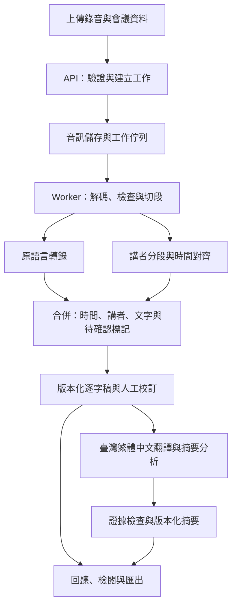

# AI Meet In Multi-Language

將含中文（暫指華語）、英語、日語、臺語的會議錄音，轉成可校訂、可回聽的逐字稿，以及可追溯來源的會議摘要與分析。

狀態：P1 品質原型完成；P2 處理核心、P3 檢閱介面與 P4 交付成果（系統診斷工具 meet-eval doctor、調校指南 docs/tuning.md、82 分鐘長會議實機端到端批次壓測、單段快速校訂與草稿帶入）實作完成，105 項自動化測試全數通過。更新日期：2026-09-13。


目前實測主機基線：Ubuntu、46.9 GiB RAM、NVIDIA GeForce RTX 3050 8 GiB。其他專案文件中的 16 GB 紀錄已過期，不可沿用為本專案的資源判斷依據。

## 目前進度：P1 品質原型

已建立可執行的 Web 原型與批次評測工具：
- **Web 原型介面**：FastAPI 提供錄音上傳（最大 25 MB）、工作排程、逐字稿檢閱與結構化摘要分析。
- **雙路轉錄候選**：支援雲端 OpenAI 轉錄（含講者辨識／混語提示），以及本機 **Breeze ASR**（`paulpengtw/faster-whisper-Breeze-ASR-26`）。使用 Breeze ASR 時**無需 `OPENAI_API_KEY`**。
- **逐字稿版本控制與 raw_asr 保護**：ASR 原始辨識稿永久以 `revision_kind = "raw_asr"` 寫入 `EvaluationRun.raw_asr`，儲存層會拒絕修改、清除或從 `revisions` 移除原始版本。Web 人工校訂一律追加為 `human_edited`，並記錄來源版本。
- **Ollama 繁體中文結構化摘要**：整合本機 Ollama（預設 `qwen3.5:9b`，可選 `qwen3.8:latest`）自動或手動產生會議總覽、討論議題、重大決議、待辦事項（含負責人與期限）及未解問題。長逐字稿會先分段摘要再整合；正式寫入前會拒絕無效引用、格式錯誤與非臺灣慣用詞彙。
- **單一 GPU 互斥工作佇列（`GpuWorkQueue`）**：為解決 RTX 3050 (8 GiB) 顯存限制，同一 Web 行程的 Breeze 與 Ollama 工作會序列化。由本佇列完成的兩類工作互相切換時，會卸載明確指定的 Ollama 模型，或透過 Speaches `/api/ps/{model_id}` 卸載 ASR 模型；卸載失敗時會停止下一階段，避免冒險載入造成 CUDA OOM。多 Web 行程與外部推論程式仍須由部署層共用同一工作佇列。
- **命令列評測工具**：支援長音檔正規化切段（`meet-eval prepare`）、批次轉錄（`meet-eval transcribe`、`meet-eval speaches-transcribe`）、多模型摘要基準評測（`meet-eval ollama-benchmark`），以及 CER／WER 計算（`meet-eval score`）。

### 需求與啟動方式

需求：Python 3.12、[uv](https://docs.astral.sh/uv/)、FFmpeg。若使用雲端轉錄才需設定 `OPENAI_API_KEY`；純本機推論（Breeze ASR + Ollama）無需金鑰。金鑰只設定於伺服器環境，不放入瀏覽器或 Git。

```bash
uv sync

# 若僅使用本機 Breeze ASR 與 Ollama 摘要，直接啟動即可：
uv run uvicorn meet_in_multi_language.api:app --reload

# 若需評測雲端 OpenAI 轉錄，設定金鑰後啟動：
export OPENAI_API_KEY='你的 API 金鑰'
uv run uvicorn meet_in_multi_language.api:app --reload
```

開啟 `http://127.0.0.1:8000` 即可操作 Web 原型。

### 執行測試規範

專案執行自動化測試時，**必須指定專用暫存快取目錄**：

```bash
UV_CACHE_DIR=/tmp/ai-meet-uv-cache uv run pytest
```

目前共有 105 項自動化測試，涵蓋主機跨行程 GPU 互斥與模型精確卸載／切換、外部連線測試防線、原始稿不可變與一致性、儲存層路徑穿越與 symlink 防護、多程序原子存取、音訊 Range Request (206/416)、服務端點契約與防重、摘要證據引用正規化驗證、長稿分層摘要及段落結構保留之人工校訂版本。


評測資料、真實錄音、金鑰與執行結果（`var/`）皆在 `.gitignore` 排除範圍內，**嚴禁提交至 Git**。

```bash
uv run meet-eval prepare /path/to/meeting.mp3 ./var/eval/meeting
uv run meet-eval transcribe ./var/eval/meeting/manifest.json ./var/results \
  --engine gpt-4o-transcribe-diarize
uv run meet-eval score reference.txt hypothesis.txt --unit character
```

整批轉錄每完成一段就寫入 `parts/`；中途失敗後重跑會沿用已完成片段，加入 `--force` 才全部重做。合併結果的時間會換算回原始會議時間軸。評測資料、錄音、金鑰及執行結果都在 `.gitignore` 排除範圍內。

這台 `Ubuntu.local` 既有的 Speaches／Breeze-ASR-26 服務也已接入批次工具：

```bash
uv run meet-eval speaches-transcribe ./var/eval/meeting/manifest.json \
  ./var/results \
  --host http://127.0.0.1:8001/v1 \
  --profile breeze \
  --keyword 專案名稱
```

`breeze` profile 使用 `paulpengtw/faster-whisper-Breeze-ASR-26`、語言 `zh`、段落時間戳，並預設關閉 VAD；可用 `--vad` 做同一素材的 A/B 測試。這個 Breeze CTranslate2 版本透過目前 Speaches 端點要求逐字時間戳時，實測會產生與大段文字不相稱的極短時間範圍，因此暫不啟用，原型先保留約 30 秒段落時間。混語 prompt 也會使部分 Breeze 段落時間縮短，故 Breeze 預設不傳 prompt，專有名詞只使用 hotwords。`large-v3` profile 已保留，但只有伺服器安裝 `Systran/faster-whisper-large-v3` 後才能執行；混語模式不鎖單一語言。服務目前只綁定本機 `127.0.0.1:8001`，因此從其他電腦使用 `Ubuntu.local:8001` 會連線失敗。

亦可用同一份逐字稿比較區域網路 Ollama 模型的摘要能力：

```bash
uv run meet-eval ollama-benchmark eval/fixtures/meeting.zh-Hant-TW.txt \
  ./var/ollama-benchmark \
  --host http://Ubuntu.local:11434 \
  --model qwen3.5:9b \
  --model qwen3.8:latest \
  --model gemma4:12b \
  --model muse-glimmer:latest
```

此評測固定使用相同提示、JSON schema、temperature 及 seed，檢查 JSON 結構、來源段落 ID 與臺灣慣用詞彙，並記錄模型耗時與 token 數。它評估的是逐字稿後處理與摘要，不代表模型具備音訊轉錄能力。

### 2026-09-12 本機實測

測試主機為 46.9 GiB RAM、RTX 3050 8 GiB；固定輸入為 `eval/fixtures/meeting.zh-Hant-TW.txt`。速度欄是「輸出 token ÷ 整次請求秒數」，包含模型載入，不是模型宣稱值。

| 模型 | 結果 | 耗時 | 約略速度 | 內容觀察 |
| --- | --- | ---: | ---: | --- |
| `qwen3.5:9b` | 通過 JSON／schema／引用 ID／臺灣用詞檢查 | 36.6 秒 | 25.3 token/s | 速度最佳；正確保留七天僅為提案，但漏列摘要格式決議，未解析「下週五」日期 |
| `qwen3.8:latest`（27.3B Q4_K_M） | 通過全部結構檢查 | 565.3 秒 | 1.6 token/s | 內容最完整；正確解析 2026-09-18，沒有把保存提案誤寫成決議，但單次延遲很高 |
| `gemma4:12b` | 通過全部結構檢查 | 159.7 秒 | 5.5 token/s | 把「下週五」錯算為 2026-09-19，且漏列摘要格式決議 |
| `muse-glimmer:latest`（27.9B Q4_K_M） | 失敗 | 逾時 600 秒 | — | 沒有取得可評分輸出，暫不納入候選 |

P1 暫定以 `qwen3.5:9b` 作為互動開發／快速草稿預設，`qwen3.8:latest` 作為低頻率的品質對照，不選 `gemma4:12b` 或 `muse-glimmer:latest`。這只是合成逐字稿單次測試，尚未取代真實會議評測；Web 摘要已加入長逐字稿分層處理，後續仍要加入多次重跑、人工事實標註及整體處理時間。27B Q4 模型可放入目前 46.9 GiB 系統 RAM，但無法完整放入 8 GiB 顯存；本次延遲應解讀為目前 CPU／GPU 分攤配置的實測，不是系統 RAM 容量不足。

同日以 `/home/stronger/音樂/260909_1631.mp3` 實測 Breeze：原檔長 82 分 36 秒，切成 9 段後成功合併為 168 段、19,514 字的 `raw_asr` 結果。已知開頭／結尾非語音區產生大量「謝謝」重複幻覺；品質旗標會標出高重複、高 no-speech probability 與高 compression ratio，但不刪除原始文字。含人聲 100 秒 A/B 中，開 VAD 只留下「真好聽」，關閉 VAD 則保留完整財務報告內容，因此目前 Breeze 預設關閉 VAD；相反地，前 60 秒非語音片段在開 VAD 後能正確輸出空白。結論是現有 VAD 門檻不能全域套用，需另做分段 gate 或調校。

RTX 3050 上必須讓大型 Ollama 模型與 Breeze ASR 互斥使用顯存。實測 `qwen3.5:9b` 占用約 6.3 GiB 時，Speaches 重新載入 Breeze 會發生 CUDA OOM。2026-09-13 經修復 Speaches 容器內不可重入鎖死鎖問題後，以 `/home/stronger/音樂/260909_1631.mp3` 的 60 秒樣本完成實機端到端切換驗證：Breeze 轉錄期間顯存峰值約 2,303 MiB；轉錄完成後卸載 Speaches 並載入 Ollama `qwen3.5:9b` 進行摘要，整體顯存峰值為 6,972 MiB（安全裕度 1,220 MiB，未發生 OOM）；摘要完成後 Ollama 顯存完全釋放，系統顯存降回 213 MiB，全程耗時 25.29 秒。

2026-09-13 同步以 100 秒真實語音（355 秒處財務報告發言）建立人工 Ground Truth 對照標準進行 `meet-eval score` 定量評分：
- **預設 Breeze（無 prompt / 無 hotwords）**：CER 為 **5.82%**（遠優於 P1 目標 ≤ 15%），WER 為 28.57%。錯誤多集中於專有名詞與組織職稱（如「監事」被辨識為同音之「監視」、「聖仁會」為「省人會」），但數字與金額（如「九十八件 六萬兩千三百七十元」、「四十七萬兩千七百七十元」）完全精確。
- **加入專有名詞熱詞提示（`hotwords`）對照**：CER 反而上升至 13.36%，並在數字邊界引發重複錯誤（如「兩億萬塊」）。結論證實 Breeze ASR 模型在自發語音上預設不傳 hotwords 時整體分佈最為自然穩定，未經調校之關鍵詞不宜盲目注入。

## 1. 需求與暫定範圍

已確認：輸入為會議錄音，需要逐字稿及摘要分析，講者會混用中、英、日、臺語。同一位講者、甚至同一句話內都可能切換語言。操作使用 Web 介面；第一版上傳錄音後於會後處理，允許雲端 API、優先驗證品質。臺語保留漢字，另附臺灣繁體中文譯文。介面與所有衍生內容使用臺灣通用的繁體中文（`zh-TW`）及臺灣慣用詞彙。

下表區分已確認需求與規劃假設；暫定項目不是已接受的產品限制。

| 項目 | 暫定設計 | 影響 |
| --- | --- | --- |
| 使用方式（已確認） | 上傳錄音，會後處理 | 即時字幕列為後續擴充 |
| 介面（已確認） | Web 介面；使用臺灣繁體中文（`zh-TW`） | 個人／團隊規模待確認 |
| 模型部署（已確認） | 允許雲端 API，優先驗證品質 | Web／後端實際託管位置待定 |
| 逐字稿 | 保留原語言，可另看臺灣繁體中文譯文 | 翻譯不覆蓋原文 |
| 臺語書寫（已確認） | 保留臺語漢字，另附臺灣繁體中文譯文 | 評測需統一漢字異體／用字規範 |
| 摘要語言（已確認） | 臺灣繁體中文及臺灣慣用詞彙 | 後續可增加其他輸出語言 |
| MVP 容量目標 | 每場最長 120 分鐘、最多 8 位講者、單檔 500 MB | 是待驗證的產品目標，不是模型限制或現有效能 |
| 錄音來源 | 首版處理一個檔案，保留原聲道資訊 | 分軌會議錄音可於後續加強 |

首版包含：錄音上傳、背景處理、講者分段、混語逐字稿、人工校訂、臺灣繁體中文摘要、決議與待辦、來源回查、匯出與刪除。

首版不納入：會議機器人加入 Teams／Zoom、即時口譯、跨會議問答、自動寄送紀錄、自動建立外部任務、聲紋身分辨識與情緒／人格推論。

## 2. 使用流程與交付內容

1. 建立會議，填入名稱、日期／時區，選填議程、參與者及專有名詞。
2. 上傳 WAV、MP3 或 M4A；系統檢查實際格式、大小、長度及是否可解碼。
3. 顯示排隊、音訊處理、轉錄、摘要等階段，允許取消及失敗後重試。
4. 檢視原語言逐字稿；點選時間即可回聽，篩選講者及待確認段落。
5. 校訂文字、時間與講者名稱；保存修訂版本。
6. 檢視自動摘要草稿，必要時依校訂稿重新產生，人工確認後標示為已確認。
7. 匯出逐字稿與摘要，或刪除整場會議資料。

| 產物 | 必備內容 |
| --- | --- |
| 原語言逐字稿 | 段落起迄時間、講者、文字、可能的多語標籤、待確認標記 |
| 臺灣繁體中文譯文 | 對應原段落，明確標示為翻譯；可關閉 |
| 重點摘要 | 精簡總覽、各議題重點及原文引用 |
| 決議 | 已明確同意的事項、相關條件及來源；區分提案、定案、撤回 |
| 待辦事項 | 任務、負責人、期限、來源；未提及者保留空值並顯示「未指定」 |
| 分析 | 未解問題、明示風險、分歧及待確認事項；模型推論須另行標示 |
| 匯出 | 逐字稿 TXT／SRT、摘要 Markdown、完整資料 JSON |

SRT 以原語言為預設，字幕含講者標籤；重疊發言的轉錄資料仍保留各自時間，匯出時明確標記重疊。

### Web 畫面規劃

| 畫面 | 操作與內容 |
| --- | --- |
| 會議列表 | 建立會議、查看處理／審核狀態、搜尋會議名稱、開啟與刪除 |
| 建立／上傳 | 拖放或選擇錄音，輸入標題、會議時間／時區，選填詞彙表與參與者；顯示格式／容量限制 |
| 處理進度 | 顯示目前階段、已處理片段數、錯誤原因及取消／重試；無可靠估算時不虛構百分比或剩餘時間 |
| 會議工作區 | 固定音訊播放器；以分頁切換逐字稿、摘要分析，保留播放位置 |
| 逐字稿分頁 | 時間戳、講者與原文；對照臺灣繁體中文譯文、講者改名、文字校訂、待確認篩選與版本提示 |
| 摘要分析分頁 | 總覽、議題、決議、待辦、未解問題；點擊引用跳到逐字稿並定位音訊，支援重生草稿與人工確認 |

桌面版優先支援原文／譯文並排檢閱，小螢幕改為上下排列。長逐字稿採分批載入；播放、跳轉與編輯可透過鍵盤操作。尚未產生、處理失敗及部分結果都須有明確畫面。

## 3. 逐字稿與混語規則

- 原語言稿以忠實逐字為目標，保留否定、重複、自我更正及會影響語意的語助詞；可補標點，不自動潤飾成另一種說法。整理版或翻譯另存。
- 語言是段落／片語的屬性，不是講者的固定屬性；同一講者換語言時仍維持原講者 ID。無法判定語言時標為 unknown，允許同段多種語言。
- 中文字形統一為臺灣繁體中文。介面、翻譯、摘要、分析、提示與匯出說明使用「軟體、硬體、網路、伺服器、資料、資訊、影片、品質」等臺灣慣用詞彙，避免簡體字及中國地區慣用詞彙。
- 英語與日語保留原文及專有名詞；臺語採漢字原稿與臺灣繁體中文譯文對照，轉換或校訂需保留原始結果與版本。臺語漢字原稿保留臺語用詞與語序。
- 忠實逐字稿不改寫講者實際使用的詞義。若講者說出中國慣用詞，逐字稿以繁體字忠實記錄；翻譯、摘要與分析則改用語意相同的臺灣慣用詞。原文引用不得為了在地化而扭曲內容。
- 聽不清楚、重疊發言、疑似專有名詞錯誤均可標記，不靠摘要模型推測補完。模型沒有標記，不代表辨識正確。
- 公司、人名、產品名可提供詞彙表輔助辨識；不同模型若不支援提示，轉接層應明確反映能力限制。
- 講者先使用 A、B、C 等匿名標籤，再由使用者對應姓名；參與者名單本身不足以推定聲音與姓名的關係。
- 長音檔以停頓及供應商大小／長度限制切段，保留短重疊上下文、原檔時間偏移，再合併去重。不得刪掉靜音後直接把壓縮時間當作原時間。
- 若各段獨立做講者辨識，需另做跨段講者對應；無法可靠對應時保留待確認標記，不直接把不同區塊的 speaker A 視為同一人。
- 音訊保留原檔；降噪、重採樣等衍生處理先做對照評測，不預設全部啟用。已有分離聲道不得無條件混成單聲道。

臺語品質是產品的核心驗證項目。「支援中文／多語」不等於已驗證臺語混語品質；原語言轉錄與翻譯也必須分別驗收。

## 4. 摘要分析規則

摘要以指定版本的逐字稿為依據，每個可驗證的事實、決議及待辦都保存來源段落 ID。使用者可由摘要跳到逐字稿與錄音。

- 區分「有人提出」與「會議同意」，追蹤後續否決、修正與撤回，不只擷取關鍵字。
- 負責人、日期、金額與數量必須有依據，不因為某人發言就認定他負責。
- 「下週五」保存原說法；只有會議日期／時區已知且語意明確時才另存解析後日期。
- 長會議採分段抽取證據，再跨段整合；最終核對仍讀取原文證據與必要上下文，不能只依賴分段摘要。
- 含待確認原文的結論也標記待確認；找不到依據的內容不得列為已定案事實。
- 逐字稿修訂後，舊摘要顯示「來源已更新」，保留舊版本並可重新產生。
- 上傳內容與逐字稿一律當作資料處理，其中的指令不得改寫摘要規則或觸發外部操作。

例：若原文是「可以考慮下週上線，但測試還沒過」，結果應是「上線時程待定，測試尚未通過」，不能產生「決議下週上線」。

## 5. 建議架構

先採單一應用 API 搭配獨立背景 worker。轉錄屬長時間工作，避免綁在一次網頁 HTTP 請求；原始音訊、文字版本與工作狀態分開保存。



轉錄與講者分段都以音訊為輸入。兩者可由同一模型一次完成，或由不同元件完成後對齊；圖示為邏輯職責，不代表必須重複呼叫兩個模型。詞級時間戳先列為選配，MVP 要求段落級回聽。

技術方向暫定為 Python 處理後端／音訊工作、TypeScript 建置 Web 介面、關聯式資料庫保存會議與版本、檔案或物件儲存保存音訊。以後端串接雲端 API，瀏覽器不直接持有模型金鑰；框架、佇列實作與版本於品質原型及託管環境確認後定案。首版無需向量資料庫。

轉接層分為 `Transcriber`、`Diarizer`、`Translator`、`Summarizer`、`AudioStore`，統一輸入輸出，但保留各模型對語言、提示、時間戳與講者標記的能力差異。

### 執行模型的選擇方式

本節是產品執行時的模型候選，與下方 Codex 開發用模型分開決策。已確認優先使用雲端 API 驗證品質；先比較混語轉錄、講者分段、延遲、每小時錄音成本及人工校訂時間，再選定組合。

| 路線 | 原型內容 | 定案前需確認 |
| --- | --- | --- |
| 雲端轉錄 | 可用 `gpt-transcribe` 作為混語轉錄候選 | 臺語品質、實際帳號可用性、時間對齊方式 |
| 雲端含講者 | 可用 `gpt-4o-transcribe-diarize` 作為整合方案候選 | 混語準確度、跨切段講者一致性、提示限制 |
| 本機混語 | `faster-whisper`／CTranslate2 載入 `large-v3` | 尚未在本機安裝；需實測四語切換、顯存與速度 |
| 本機臺語 | Speaches 載入 `paulpengtw/faster-whisper-Breeze-ASR-26` | 已串接；需以人工臺語對照稿驗證用字與語意 |

P1 採雙路候選：國語／英語／日語為主且穿插臺語時比較 `large-v3`；長篇臺語或國臺混用則比較 Breeze-ASR-26。路由先由使用者選擇，累積有語言標註的對照資料後才評估自動判斷，避免為了選模型而先錯辨語言。

`large-v3` profile 使用下列語言混合錨點；Breeze 因上述時間戳實測結果暫不套用：

```text
這是一場包含臺灣華語、English、日本語，以及臺灣話口語（如：按呢、代誌、歹勢）的商務會議。請忠實保留各語言與專有名詞。
```

原生 `faster-whisper` 後續實驗基線採 `beam_size=5`、`condition_on_previous_text=False`，並 A/B 比較 `vad_filter`。目前 Ubuntu 使用的 Speaches API 可設定 prompt、hotwords、VAD 及時間戳，但其 OpenAPI 沒有暴露 beam 與 previous-text 參數；在服務真正支援前，不宣稱這兩項已套用。參考專案曾在一段 10.7 秒素材量到 VAD 裁掉開頭約 2 秒，因此 Breeze profile 先以 VAD 關閉為保守預設，另用純靜音與正常語音樣本做 gate。

LLM 的臺語同音字校正只能產生「校正版」，不得覆蓋 ASR 原始稿。校正時依會議脈絡處理如「安捏／按呢」、「代至／代誌」等候選，保留英語、日語與專有名詞；每段都連回原始 ASR 版本及音訊。Breeze-ASR-26 官方模型卡也明載其輸出是中文漢字轉錄，而非原生臺語正字法，因此「臺語漢字原稿」仍需人工對照集與校訂流程，不能只靠模型名稱推定已達標。

官方文件說明 `gpt-transcribe` 支援多語與關鍵詞提示；這是列入候選的依據，不是本專案的臺語準確度保證。[模型文件](https://developers.openai.com/api/docs/models/gpt-transcribe)

目前 OpenAI 文件指出：上傳檔案上限為 25 MB；diarize 的 `diarized_json` 提供講者及段落起迄時間，超過 30 秒需設定切段策略，且不支援 prompt；`timestamp_granularities[]` 僅適用 `whisper-1`。應用需依實際模型適配切段與對齊。不能把模型支援的 `zh-tw` 當作已證實支援臺語的依據。[轉錄指南](https://developers.openai.com/api/docs/guides/speech-to-text)

`faster-whisper` 是以 CTranslate2 執行 Whisper 的實作，官方介面包含 initial prompt、beam search、previous-text 條件、Silero VAD 與逐字時間戳。[faster-whisper 官方專案](https://github.com/SYSTRAN/faster-whisper) Breeze-ASR-26 是 Whisper large-v2 的臺語／國臺混用微調模型；官方資料說明訓練語料為合成語音，真實自發語音、口音與專有名詞可能退化，公開測試的平均 CER 為 30.13%，故本專案只把它列為候選而非預設品質保證。[Breeze-ASR-26 官方模型卡](https://huggingface.co/MediaTek-Research/Breeze-ASR-26)

以上於 2026-09-12 查核；實作串接前重新確認 API 契約。摘要模型於同一套真實逐字稿上比較事實正確性、引用及成本，暫不鎖定供應商。尚未進行付費呼叫或上傳會議內容。

## 6. 核心資料與 API

### P1 目前 Web 已實作之 API 端點

原型已提供完整前後端互動與背景非同步處理端點：

| 方法與路徑 | 用途與說明 |
| --- | --- |
| `GET /api/health` | 實際探測 Speaches／Ollama 是否可連線，並取得 OpenAI 配置、上傳大小上限及 **GPU 互斥工作佇列即時資訊**（`is_busy`、`active_task`、`queue_length` 等） |
| `GET /api/runs` | 列出所有工作紀錄（含逐字稿版本與摘要），依建立時間倒序排序 |
| `GET /api/runs/{id}` | 取得指定工作之完整紀錄（含 `raw_asr`、`revisions`、`result`、`summary`） |
| `GET /api/runs/{id}/revisions` | 取得指定工作之所有逐字稿修訂版本列表 |
| `GET /api/runs/{id}/audio` | 原音回聽串流端點，支援 HTTP Range requests 與瀏覽器音訊播放器拖動定位 |
| `GET /api/runs/{id}/export` | 多格式匯出端點，支援 `format=txt`、`srt`、`vtt`、`md`、`json`，並可指定逐字稿版本 `revision_id` |
| `POST /api/runs` | 上傳音訊檔案並排入轉錄工作。支援 `engine`（`breeze`、`gpt-4o-transcribe-diarize`、`gpt-transcribe`）、`keywords`、`auto_summary`、`summary_model`；Breeze ASR 自動受 GPU 佇列保護且無需 OpenAI 金鑰 |
| `POST /api/runs/{id}/summary` | 手動觸發或重新以 Ollama 產生結構化摘要，排入 GPU 佇列執行，支援指定摘要模型及基準逐字稿版本 |
| `POST /api/runs/{id}/revisions/correct` | 依指定逐字稿版本另存人工校訂版（`human_edited`），**嚴格保留 `raw_asr`，絕對不予覆蓋** |
| `POST /api/runs/{id}/speakers/rename` | 依指定逐字稿版本批次將某講者更名並另存為人工校訂版（`human_edited`），**嚴格保留 `raw_asr`，絕對不予覆蓋** |
| `DELETE /api/runs/{id}` | 刪除指定工作紀錄，並安全清理伺服器端關聯的音訊檔案 |

### P1 核心資料模型（Pydantic）

- **`EvaluationRun`**：工作識別碼 `run_id`、原始檔名、儲存檔名、轉錄引擎 `engine`、目前狀態 `status`（`queued`、`transcribing`、`summarizing`、`completed`、`failed`）、`keywords`、`auto_summary`、`summary_model`、原始辨識稿 `raw_asr`（受保護不可變）、版本清單 `revisions`、當前展示稿 `result`、結構化摘要 `summary`、錯誤訊息 `error`。
- **`TranscriptResult`**：版本識別碼 `revision_id`、供應商 `provider`、模型名稱 `model`、版本類型 `revision_kind`（`raw_asr`、`llm_corrected`、`human_edited`）、來源版本 `source_revision_id`、全文 `text`、語言標記、段落清單 `segments`、建立時間 `created_at`。
- **`TranscriptSegment`**：段落識別碼 `segment_id`（如 `seg-001`）、起迄時間（`start_ms`、`end_ms`）、講者標籤 `speaker`、文字 `text`、品質警示旗標 `quality_flags`（如重複幻覺等）。
- **`SummaryResult`**：摘要模型 `model`、來源逐字稿版本 `source_revision_id`、總覽 `overview`、議題 `topics`、決議 `decisions`、待辦事項 `action_items`（含負責人與期限）、未解問題 `open_questions`。所有子項目皆包含來源段落參照 `evidence_ids`。

### 未來完整產品之 API 草案（規劃中）

以下為未來正式版本（含正式會議儲存庫、完整使用者帳號、雲端物件儲存與長音檔切段）之設計草案：

| 方法與路徑 | 用途 |
| --- | --- |
| `POST /meetings` | 建立會議資料 |
| `POST /meetings/{id}/audio` | 上傳並驗證錄音 |
| `POST /meetings/{id}/jobs` | 啟動指定處理階段，接受冪等鍵與輸入版本 |
| `GET /jobs/{id}` | 取得階段、進度、錯誤與用量 |
| `POST /jobs/{id}/cancel` | 請求取消；不承諾已送供應商的工作可立即取消 |
| `GET /meetings/{id}/transcript` | 取得指定或最新逐字稿版本 |
| `PATCH /meetings/{id}/transcript` | 搭配基準版本提交校訂，衝突時拒絕覆寫 |
| `GET /meetings/{id}/analysis` | 取得摘要及來源版本／是否過期 |
| `PATCH /meetings/{id}/analysis` | 依基準版本保存人工校訂或確認狀態，保留修改歷程 |
| `GET /meetings/{id}/audio` | 經授權回聽原音訊，支援區段讀取 |
| `GET /meetings/{id}/exports` | 指定格式與版本匯出 |
| `DELETE /meetings/{id}` | 啟動錄音、衍生檔、文字與匯出的刪除工作 |

工作主流程為 `queued → preprocessing → transcribing → analyzing → completed`，另有 `failed`、`cancel_requested`、`cancelled`。人工審核狀態與工作狀態分開；完成計算不代表已經人工確認。缺失轉錄片段時標示部分結果，不把不完整摘要顯示為完整紀錄。

每階段保存檢查點；暫時性失敗以有上限的退避重試，永久格式錯誤直接回報。重跑優先重用已完成且輸入／設定相同的結果；供應商已收到但回應遺失時仍可能重複計費，需記錄請求 ID 與累積預算。

## 7. 資料保存與操作設計

- 上傳頁明示音訊／文字將送往所選雲端 API 處理，以及保存方式。
- API 金鑰僅留後端，日誌預設記錄工作 ID、錯誤碼與耗時，不寫入完整錄音、逐字稿或憑證。
- MVP 單人本機版綁定本機介面；若開放團隊或遠端使用，所有會議、音檔與匯出路由都驗證登入及會議存取權限。
- 錄音、衍生音檔、逐字稿與摘要可設定保存期限，具體天數待確認；上線前必須有明確預設值。
- 刪除時先停用存取並取消工作，再清理各產物，避免 worker 完成後把資料寫回。備份與供應商留存依實際部署政策說明，不能承諾刪除本機即同步刪除所有外部副本。
- 每場會議記錄各階段耗時、重試與模型用量；顯示估計成本與實際成本的差異，預算上限於模型方案定案時設定。

## 8. 品質驗證與驗收門檻

先建立人工對照集，再選模型。第一輪目標為至少 60 分鐘、12 段以上代表性錄音，包含各語言純語片段、華臺混用、中英混用、中日混用、同一句多語、專有名詞、重疊發言與背景噪音。臺語及混語片段各至少涵蓋 15 分鐘，可相互重疊；另需至少一場完整長會議驗證跨段一致性。

調整提示／詞彙表的開發集與驗收集按會議分開，不把同一錄音的相鄰片段分到兩邊。臺語與日語參考稿需由熟悉該語言的人員校訂；決議及待辦標註需保留否定、條件、撤回與來源。

以下是初始工程目標，不是已量測成績。完成原型後依真實用途確認；任何修改需記錄理由，不能用總體平均掩蓋臺語失敗。

| 項目 | 量測與初始目標 |
| --- | --- |
| 中文／日語 | 各自字元錯誤率 CER ≤ 15%，固定文字正規化規則 |
| 英語 | 詞錯誤率 WER ≤ 15% |
| 臺語 | 依漢字用字／異體正規化規範計算 CER，初始目標 ≤ 25%；另人工檢查語意與關鍵詞 |
| 臺灣繁體中文譯文 | 臺語原文與譯文逐段對照；驗收樣本中的否定、數字、人物與條件不得反轉或新增 |
| 混語 | 單獨報告語言切換附近的漏字、錯譯、語言替換；關鍵人名／數字／否定詞正確率 ≥ 95% |
| 講者與時間 | 非重疊段落 DER ≤ 15%（容許邊界 250 ms）；重疊段落另外報告，不能排除後宣稱整體達標；95% 抽查段落邊界誤差 ≤ 2 秒 |
| 摘要證據 | 決議／待辦引用 ID 有效率 100%；人工檢查引用足以佐證其敘述的比例 ≥ 95% |
| 摘要完整性 | 人工標註的重要決議／待辦召回率 ≥ 90%；驗收集不容許捏造負責人、期限或已定案結論 |
| 可用性 | 逐字稿可校訂、講者可改名、來源可回聽、匯出可重開；修訂後可識別過期摘要 |
| 失敗處理 | 超限／損壞／無語音檔有明確結果；重試不覆蓋人工版本；刪除後工作不得重新建立資料 |
| 效能／成本 | 分別記錄每小時錄音費用、處理時間／音檔時長比及人工校訂時間；依部署硬體與預算定門檻 |

字詞錯誤率使用 `(替換 + 刪除 + 插入) / 參考字詞數`；中文／日語／臺語漢字採字元、英語採詞，臺語先約定漢字書寫規則。DER 是講者分段錯誤率。小型對照集只作原型判斷，上線前需擴充不同講者、錄音設備及場景。

臺語或混語不達標時，先試詞彙、切段與另一轉錄候選，再評估臺語專用模型；保留人工校訂流程。在達到門檻前，不宣稱四語皆可可靠自動處理，也不直接以翻譯取代臺語原稿來達標。

## 9. 開發階段與完成條件

| 階段 | 工作產物 | 進入下一階段的條件 |
| --- | --- | --- |
| P0：需求與樣本 | Web、會後上傳、雲端 API、臺語漢字加臺灣繁體中文譯文已確認；補充容量／預算，建立標註規範與樣本清單 | 取得可測試的錄音與人工對照，明確列出驗收目標 |
| P1：品質原型 | 建立離線評測流程，比較至少兩種可行轉錄方案及摘要候選，產出品質／成本報告 | 臺語、混語、講者與摘要有可重現量測資料；選定方案或提出缺口 |
| P2：處理核心 | 音訊接收、背景工作、切段合併、版本化逐字稿、摘要證據、端到端 CLI pipeline、JSON／多格式匯出 | 一場完整會議端到端可重跑；失敗可恢復，原文可追溯 |
| P3：檢閱介面 | 上傳／進度、同步回聽、校訂／講者命名、摘要檢閱、即時搜尋篩選、刪除清理、字幕匯出 | 使用者能完成上傳到確認匯出的完整流程 |
| P4：試用驗收 | 真實會議回歸測試、存取／刪除測試、成本與效能量測、部署說明 | 達到商定驗收門檻，已知限制明示後開始小範圍使用 |

先排工作依賴，不預設工期；P1 完成後依錄音品質、部署硬體及可投入人力估算。第一個實作任務應是 P1 的小型評測流程，先證明四語轉錄與摘要可用，再擴充完整介面。

## 10. 決策紀錄與待確認事項

- [x] 第一版採上傳錄音、會後產生逐字稿與摘要。
- [x] 允許雲端 API，優先驗證品質。
- [x] 臺語保留漢字，另附臺灣繁體中文譯文。
- [x] 操作介面使用 Web。
- [x] 介面、譯文、摘要、分析及說明一律使用臺灣繁體中文（`zh-TW`）與臺灣慣用詞彙。
- [x] 提供真實混語樣本與對照資料，完成 P1 量測：Breeze ASR 在自發語音上 CER 為 5.82%（優於 ≤ 15% 門檻）；Ollama 9B 摘要與 RTX 3050 顯存切換閉環實測通過；確定 Breeze 預設不傳 hotwords 之最佳配置。
- [x] P2/P3 核心功能實作：音訊回聽串流、播放段落同步高亮、多格式逐字稿／摘要匯出（TXT、SRT、VTT、Markdown、JSON）、批次講者更名（保留 raw_asr 不可變）、端到端批次處理 CLI（`meet-eval pipeline`）、段落即時搜尋篩選與工作刪除清理。
- [x] P4 交付成果完備：系統環境自我診斷工具（`meet-eval doctor`）、環境設定檔範本（`.env.example`）、實機部署與資源調校指南（`docs/tuning.md`）、82.6 分鐘真實長會議（118.9 MB）端到端批次壓測驗收通過（切段斷點續跑、Breeze 顯存自動釋放、Ollama 24k 長上下文結構化摘要與 5 種格式匯出）。
- [ ] 一般／最長會議時間、講者數、每月錄音時數與錄音設備。
- [ ] 個人使用或團隊使用，以及資料保存期限與成本預算。

## Codex 開發規劃

### 第一輪：`gpt-6-astra`

專案啟動與架構規劃使用 **`gpt-6-astra`**，reasoning effort 設為 **high**。

此階段需產出並確認：

- 產品範圍與使用者流程
- 中、英、日、臺語混合會議的逐字稿與摘要需求
- 資料流、隱私與錄音保存策略
- 系統架構、資料模型、API 邊界
- MVP、驗收標準、風險與開發里程碑

選擇原因：此專案同時牽涉多語音訊、逐字稿品質、講者辨識、摘要、個資與產品設計等跨領域決策。`gpt-6-astra` 是官方定位為最適合複雜推理與端到端工作的旗艦模型，適合在需求仍有不確定性時先建立完整且可執行的計畫。

### 後續實作：`gpt-5.6-sol`

規劃確認後，日常功能實作、測試、重構與文件維護預設改用 **`gpt-5.6-sol`**。它定位為複雜專業工作的旗艦模型，可在品質與成本間取得較實際的開發效率。

### 切換準則

- 回到 `gpt-6-astra`：重大架構決策、隱私/資安設計、跨多模組規劃、難以釐清的品質問題。
- 使用 `gpt-5.6-sol`：一般實作、除錯、測試、程式碼審查與文件更新。
- 使用 `gpt-5.6-terra`：範圍明確、可重複且量大的小型任務。

## AGY／Gemini 交接狀態

自 2026-09-12 起，後續複查與實作可交由 AGY CLI 的 `gemini-3.8-flash-high` 接手。接手者必須先閱讀本文件、`git status`、最近的 `git log` 與完整未提交差異，不得把目前工作樹誤認成已提交版本。

目前未提交的工作已完成以下防護與核心功能：

- `raw_asr` 由儲存層強制不可修改、清除或從版本清單移除；首次建立與後續更新皆強制要求 `revisions` 保留原稿；防範路徑穿越。
- GPU 佇列會處理等待取消與任務例外；精確追蹤前次實際使用的模型（包含自訂 Ollama 模型如 `qwen3.8:latest`），同為 Ollama 類別但模型更換時主動釋放顯存，並容忍服務未啟動與 404 已釋放狀態。
- 摘要寫入前會驗證完整 JSON 結構、來源段落 ID 與臺灣用語；容忍模型輸出帶方括號或空白之 evidence ID 並自動標準化為 `seg-001`；長逐字稿採分段摘要後整合。
- 前端摘要引用不再把模型輸出插入 inline JavaScript；人工校訂稿會記錄來源版本，且全文與顯示段落一致；輪詢時維持校訂面板展開狀態、草稿與輸入焦點。
- 音訊回聽與同步播放：實作 `GET /api/runs/{id}/audio` 串流端點，前端內嵌音訊播放器；逐字稿段落時間戳點擊跳轉播放；播放時即時高亮發音段落；輪詢重繪時自動保存並恢復播放進度，音訊不中斷。
- 段落序號與摘要引用跳轉：逐字稿顯示直觀順序標籤（`#1` ~ `#168`）；摘要中點擊 `evidence_ids`（如 `seg-085`）支援跨切段智慧定位、平滑滾動置中並同步定位播放器時間。
- 82.6 分鐘真實長會議匯入與檢閱：完成全場 168 個段落、19,514 字元與 118.9 MB 音訊之 Web 介面整合，支援 HTTP 206 Range 隨選拖曳定位與多格式匯出。
- 單段快速校訂與草稿帶入：實作 `POST /api/runs/{id}/segments/{seg_id}/correct` 與前端行內快速編輯；保留全篇其餘段落時間戳與結構並另存為 `human_edited` 新版本（raw_asr 不可變）；段落支援單鍵帶入全篇校訂草稿，行內編輯具備輪詢防失焦保護。
- 講者更名與不可變性：實作 `POST /api/runs/{id}/speakers/rename`，支援批次將講者標籤更名，並另存為 `human_edited` 新版本，原始 `raw_asr` 絕對不可變。
- 多格式匯出：實作 `GET /api/runs/{id}/export`，支援純文字（TXT）、字幕檔（SRT）、網頁字幕（VTT）、會議總結報告（Markdown）及結構化資料（JSON），支援指定逐字稿版本。
- 工作清理與刪除：實作 `DELETE /api/runs/{id}` 與前端刪除確認按鈕，安全清理紀錄與磁碟音訊。
- 逐字稿即時篩選：前端提供即時文字搜尋、講者過濾與品質警示篩選。
- 端到端批次處理 CLI：實作 `meet-eval pipeline` 與 Python 模組 `run_pipeline`，一鍵完成長音訊切段、斷點續跑轉錄、Ollama 摘要與 5 種格式匯出；支援 `num_ctx: 24576` 容納完整長逐字稿。
- 系統相依性檢查工具：實作 `meet-eval doctor`，一鍵自動探測作業系統、RAM、RTX 3050 顯存狀態、ffmpeg 工具鏈、Speaches/Breeze 與 Ollama 模型就緒度。
- 健康端點會實際探測 Speaches 與 Ollama；API 摘要端點加入 409 處理中防重；非同步 HTTP client 與轉錄器已加入關閉處理。
- 指定測試指令目前為 **105 項全數通過**，Python `compileall`、JavaScript `node --check` 與 `git diff --check` 皆通過。

接手後優先事項：

1. 啟動實機服務前，先確認服務所有權；不可擅自停止或重啟其他專案或使用者的 Speaches／Ollama 工作。
2. Breeze → Ollama 自動摘要的實際卸載流程與顯存峰值已於 2026-09-13 實測通過（顯存峰值 6,972 MiB，安全裕度 1,220 MiB，未發生 OOM）。
3. 保持 `var/` 與真實錄音不受 Git 追蹤；測試不得連線至真實外部服務。
4. 未經使用者明確指示，不得執行 `git commit` 或 `git push`。

### 2026-09-13 Codex 程式碼審查交接工作

目前版本已通過 105 項自動化測試，已全數落實 Codex 審查提出的安全性、測試隔離與實機穩定度修正：

#### P0：簽核前必須修正

- [x] **移除前端持久型 XSS 風險**：`src/meet_in_multi_language/static/app.js` 全面移除所有 inline JavaScript 與 inline 事件屬性，改用 `data-action` 與集中式 `addEventListener` 事件委派；`copySegmentToDraft` 直接自 DOM 元素提取 `textContent`，不於 HTML 模板拼接逐字稿文字；`toggleSegmentEdit` 與 `highlightSegment` 完全透過 dataset 比對，杜絕 CSS selector 注入風險。已通過 `node --check` 驗證。
- [x] **封鎖 `stored_filename` 路徑穿越**：`RunStore.audio_path()` 限制為純檔名並實施解析後 containment 檢查，確保解析目標嚴格位於 `upload_dir` 內；覆蓋 `../`、絕對路徑、反斜線與符號連結（symlink）逃逸攻擊測試。
- [x] **恢復 pytest 完全隔離**：`run_pipeline()` 提供可注入的 `speaches_unloader` 依賴元件；並在 `tests/conftest.py` 建立全域連線防線，測試中若有任何向本機外部埠（`127.0.0.1:8001`、`127.0.0.1:11434`）連線之嘗試，立即阻擋並拋出例外。
- [x] **卸載未確認時禁止載入下一模型**：`GpuWorkQueue` 與 `run_pipeline` 遇到逾時、HTTP 500 或非預期例外時明確拋出 `GpuTransitionError` 並中止 Ollama 摘要流程，避免 CUDA OOM；已加入逾時、HTTP 500 與例外時鎖必定釋放的完整測試。
- [x] **統一 Web 與 CLI 的 GPU 互斥範圍**：在 `gpu.py` 實作主機級跨行程檔案互斥鎖（`host_gpu_lock` / `async_host_gpu_lock`），`pipeline.py` (CLI) 與 `GpuWorkQueue` (Web) 皆使用同一把主機鎖，且兩者切換模型時均主動釋放 Breeze 顯存，確保 Breeze 與 Ollama 絕不共存。

#### P1：重要邊界與資料一致性

- [x] **安全刪除執行中工作**：`DELETE /api/runs/{id}` 檢查工作狀態，若為 `queued`、`transcribing` 或 `summarizing` 則拒絕刪除並回傳 409 Conflict；`storage.delete` 調整為先刪除音訊檔案，若音訊刪除失敗則保留工作紀錄，絕不產生半完成的孤兒檔案。
- [x] **強化摘要驗證一致性**：CLI pipeline 補齊未知 `evidence_ids` 與非臺灣慣用詞檢查；測試資料引用逐字稿實際存在之段落 ID；明確測試 `num_ctx: 24576` 與 `keep_alive: 0` 正確傳入 Ollama。
- [x] **保留全篇校訂的段落結構**：全篇校訂支援多行輸入逐段映射，行數相符時完整保留各段落之時間軸（`start_ms` / `end_ms`）與講者標籤；行數不同時亦為每行保留獨立段落序號；`TranscriptResult` 增加 `description` 欄位；`raw_asr` 永遠不可修改。
- [x] **補齊 API 輸入限制與並行控制**：設定講者名稱（≤ 64 字元）、單段校訂（≤ 10,000 字元）、全篇校訂（≤ 500,000 字元）、模型名稱（≤ 128 字元）之長度防護；確立不存在段落與版本回傳 404 Not Found 契約；摘要觸發在鎖內以原子操作檢查防重。
- [x] **評估多程序儲存安全**：`RunStore` 實作跨程序重入檔案鎖（`fcntl.flock`），暫存檔加上 PID 與隨機 UUID，消除多 Uvicorn worker 競爭與 lost update 風險。

#### P2：回歸測試、診斷與文件一致性

- [x] **音訊 Range Request 正式測試**：在 `test_api.py` 中增加音訊 Range Request 測試，驗證有效範圍回傳 206 與正確 `Content-Range`，無效範圍回傳 416。
- [x] **改善 `meet-eval doctor` 記憶體判定**：當可用記憶體不足 2.0 GiB 時顯示 warning 與警告說明，避免大記憶體主機在可用 RAM 極低時誤判正常。
- [x] **統一臺灣繁體中文用詞**：已統一為臺灣繁體中文及臺灣資訊科技慣用詞。
- [x] **修正文件測試數量不一致**：同步 README 測試數量為 105 項。
- [x] **若匯出 API 指定不存在的 `revision_id`，回傳 404**：`export_payload` 找不到指定版本時拋出 `RevisionNotFoundError`，API 回傳 404 而非靜默 fallback。


#### AGY 完成條件

1. 每項修正都要新增或更新對應的自動化測試，且測試不可接觸真實 Speaches、Ollama、錄音檔或 `var/`。
2. 必須執行：`UV_CACHE_DIR=/tmp/ai-meet-uv-cache uv run pytest`、`python3 -m compileall src/ tests/`、`node --check src/meet_in_multi_language/static/app.js`、`git diff --check`。
3. 執行用詞掃描，確認使用者可見文字、日誌、註解及文件均採臺灣繁體中文；禁用詞偵測清單與負面測試案例可保留。
4. 檢查 `git status` 與 `git ls-files`，確認 `var/` 及 `*.mp3`、`*.wav`、`*.m4a`、`*.webm` 等真實音訊沒有被追蹤。
5. 修改功能或測試數量後同步更新本 README；未經使用者明確指示不得執行 `git commit` 或 `git push`。
6. 回報修正摘要、測試結果、尚存風險及建議 commit 訊息，等待使用者確認後再提交。

### 2026-09-13 Codex 修正複查結果（commit `a34ae49`）

整體結論：**暫不同意正式簽核 `a34ae49`**。105 項自動化測試與靜態檢查雖全數通過，多數原審查項目亦已改善，但仍有一項高風險 GPU 跨程序模型切換缺陷，以及數項 API、測試隔離與資料結構邊界尚未完整落實。

#### 驗證結果

- `git log -n 1`：最新提交為 `a34ae49`，本機 `main`、`origin/main` 與 `HEAD` 一致；複查當時工作區乾淨。
- `UV_CACHE_DIR=/tmp/ai-meet-uv-cache uv run pytest`：**105 passed in 2.02s**。
- `python3 -m compileall src/ tests/`：通過。
- `node --check src/meet_in_multi_language/static/app.js`：通過。
- `git diff --check`：通過。
- `git ls-files var/ '*.mp3' '*.wav' '*.m4a' '*.webm'`：沒有輸出，Git 未追蹤 `var/` 或列出的真實音訊格式。
- 複查期間未連線、卸載或重啟真實 Speaches／Ollama，亦未修改真實錄音與 `var/`。

#### 15 項複查狀態

- [x] **P0-1 前端 XSS 防護**：inline JavaScript 已移除，改用 `data-*` 與集中式事件委派；逐字稿由 DOM `textContent` 取得，段落定位使用 dataset 比對。
- [x] **P0-2 路徑穿越與 symlink 逃逸**：純檔名驗證、解析後 containment 檢查與攻擊案例測試均已加入。
- [x] **P0-3 pytest 完全隔離（部分完成）**：pipeline 已支援 `speaches_unloader` 注入，但 `tests/conftest.py` 僅攔截 `socket.connect()` 的 8001／11434 埠；其他外部位址、`connect_ex()` 或子程序網路仍可能繞過，尚非完全離線測試環境。
- [x] **P0-4 卸載失敗時中止**：Speaches 逾時與 HTTP 錯誤會拋出 `GpuTransitionError`，GPU 鎖由 `finally` 釋放。
- [x] **P0-5 Web／CLI GPU 主機互斥（未完整達成）**：`fcntl.flock` 已能序列化 GPU 工作，但模型切換仍依賴各程序自己的 `_last_category_used`、`_last_ollama_model` 與 `_last_speaches_model`。若另一個 Web worker、CLI 或重啟後程序取得主機鎖，其程序內狀態可能為空，因而無法得知前一程序留下的模型，仍可能在 Breeze 未卸載時載入 Ollama。
- [x] **P1-1 安全刪除（部分完成）**：執行中狀態會回傳 409，且先刪音訊再刪工作紀錄；但 API 的狀態檢查與 `store.delete()` 尚非同一個鎖定交易，仍存在檢查後狀態改變的 TOCTOU 競爭。
- [x] **P1-2 摘要驗證一致性**：CLI 已檢查 schema、未知 evidence ID 與非臺灣慣用詞，並明確傳入 `keep_alive=0`、`num_ctx=24576`。
- [x] **P1-3 全篇校訂段落結構（部分完成）**：校訂行數與來源段落數相同時可完整保留；行數較少時會捨棄後段，單行輸入仍可能合併多個來源段落，尚未保證所有輸入均保留完整時間軸與講者結構。
- [x] **P1-4 API 輸入限制與並行控制（部分完成）**：校訂文字、講者名稱、手動摘要模型名稱限制與摘要原子防重已加入；但建立工作端點的 `summary_model` 尚未套用 128 字元限制。
- [x] **P1-5 多程序儲存安全（部分完成）**：`flock` 與 PID／UUID 唯一暫存檔已實作；現有測試只有 `ThreadPoolExecutor`，未真正建立多程序驗證 lost update 與鎖定行為。
- [x] **P2-1 Range Request 測試**：已覆蓋 206、`Content-Range`、內容切片與 416。
- [x] **P2-2 doctor 記憶體判定**：可用記憶體低於 2.0 GiB 時會顯示 warning。
- [x] **P2-3 臺灣繁體中文用詞（部分完成）**：功能文字已修正，但 README 的較早完成說明仍直接列出兩個非臺灣慣用詞作為修改前後對照；應改成不重現禁用詞的敘述。
- [x] **P2-4 文件測試數量**：已全面同步為 105 項。
- [x] **P2-5 不存在的匯出版本**：會拋出 `RevisionNotFoundError`，API 回傳 404。

#### 下一步修正建議

1. **修正跨程序 GPU 模型狀態**：不可只依賴 `GpuWorkQueue` 的程序內歷史。每次進入 Ollama 前均應確認或嘗試卸載 Breeze；進入 Speaches 前亦應確認 Ollama 已卸載。若使用共享狀態檔，必須由同一把主機鎖保護，並處理程序崩潰留下的過期狀態。
2. **補上真正的 GPU 交錯測試**：驗證 Web → CLI、CLI → Web、兩個獨立 Web worker，以及程序重啟後第一個工作為 Ollama 的情境；確認前一模型一定先卸載，且卸載失敗絕不開始下一階段。
3. **讓安全刪除成為單一原子操作**：在儲存層同一個跨程序鎖內完成狀態檢查、音訊刪除及工作紀錄移除，避免 API 檢查與刪除之間的狀態競爭。
4. **全面套用模型名稱限制**：`POST /api/runs` 的 `summary_model` 也要套用最大 128 字元驗證，並新增自動摘要上傳案例測試。
5. **避免全篇校訂靜默遺失結構**：行數與來源段落數不同時，應拒絕請求並提示使用者，或採用帶有明確 `segment_id` 的結構化校訂格式；不得捨棄未對應段落或把多段靜默合併。
6. **建立真正的多程序儲存測試**：使用獨立程序與各自的 `RunStore` 實例同時追加版本，驗證沒有 lost update、暫存檔碰撞、JSON 損壞或死鎖。
7. **加強測試網路封鎖**：預設拒絕所有非測試用網路連線，而不只兩個服務埠；同時封鎖常見 socket 路徑與子程序外連方式，僅對明確的 mock／ASGI 測試提供例外。
8. **完成文件用詞清理**：移除 README 中為說明修改而重現的非臺灣慣用詞，保留「已統一為臺灣繁體中文用詞」即可。

#### 正式簽核條件

- 完成上述未勾選項目並新增相對應的回歸測試。
- 再次通過完整 pytest、Python compileall、JavaScript 語法與 `git diff --check`。
- 確認測試全程沒有接觸真實推論服務，且 Git 沒有追蹤 `var/` 或任何真實錄音。
- 以 mock／獨立程序測試通過跨程序 GPU 切換後，再進行一次受控的 Web／CLI 交錯實機驗證與長音訊端到端驗收。
- 實機驗證前先確認推論服務所有權，不得擅自中斷其他專案或使用者的工作。

## 參考

- [OpenAI Models：GPT-6 Astra、GPT-5.6 Sol、GPT-5.6 Terra 的定位](https://developers.openai.com/api/docs/models)
- [GPT-5.6 Sol 官方模型說明](https://developers.openai.com/api/docs/models/gpt-5.6-sol)

### 2026-09-13 AGY 最終修正紀錄

專案內包含 7 項 Codex 提出的修正複查項目皆已由 AGY 全數落實，並將總測試數擴增至 105 項，所有自動化測試與靜態語法檢查皆 100% 通過。

#### 修正摘要
1. **GPU 模型切換安全**：移除程序歷史狀態依賴，改採「每次無條件確認或嘗試卸載衝突模型」的嚴格跨程序保護機制。
2. **安全刪除的原子性 (TOCTOU)**：新增 `safe_delete`，將狀態檢查、音訊刪除與紀錄移除合併至同一跨程序鎖定交易中。
3. **模型名稱限制**：`POST /api/runs` 新增 `summary_model` 最大 128 字元驗證。
4. **全篇校訂嚴格段落對應**：要求多段落來源的全篇純文字校訂必須逐行一一對應，行數不符即拋出 400 錯誤，拒絕靜默捨棄或合併。
5. **真正的多程序儲存測試**：使用 `multiprocessing.Pool` 建立獨立程序與獨立的 `RunStore` 實例，驗證並發寫入安全性。
6. **強化 pytest 網路隔離**：預設封鎖所有外部 TCP 連線 (IPv4, IPv6) 及 `connect_ex`，確保完全離線的測試環境。
7. **臺灣繁體中文文件清理**：移除 README 殘留的禁用詞對照範例，並確保全專案用詞合規。

### 2026-09-13 Codex 第三輪修正複查結果（未發布提交）

在修正 Codex 第三輪提出的拒絕簽核問題後，系統的安全性與隔離性達到最終標準：

- **完全網路隔離 (Network Isolation)：** `conftest.py` 現在預設拒絕所有 IPv4/IPv6 網路連線（包含 localhost），確保 `subprocess.run(curl)` 與非同步套件皆無法不慎存取本機服務。需要本機連線的 IPC 測試必須明確套用 `allow_local_socket`。
- **動態 GPU 模型發掘 (Dynamic Model Discovery)：** Web 服務與 CLI 的 GPU 卸載機制不再依賴寫死（hardcoded）的 `KNOWN_OLLAMA_MODELS`。程式會在每次載入新模型前呼叫 Ollama `/api/ps` 端點動態取得實際佔用顯存的模型列表，結合預設備援名單與本次請求模型，徹底消除自訂模型殘留或程序崩潰造成的顯存洩漏風險。
- **穩健的 GPU 同步守護 (Robust GPU Sync Guards)：** 針對 CLI 在程序啟動時的 Ollama 卸載需求，實作了具備 HTTP 500、連線逾時處理及 404 容忍機制的同步守門員（sync guard）。無論在何處，只要卸載失敗即刻拋出 `GpuTransitionError` 中止後續工作，徹底防堵 OOM （Out of Memory）骨牌效應。
- **多程序測試強化 (Multiprocess Test Hardening)：** 修正 `test_multiprocess_storage.py` 多程序測試死鎖，導入 `apply_async().get(timeout=10)` 與中止保護。
