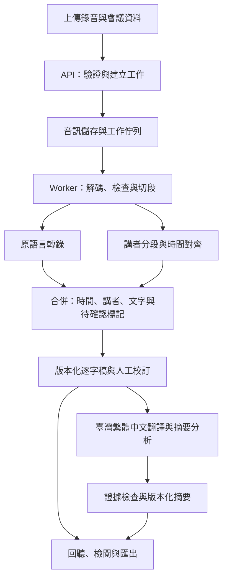

# AI Meet In Multi-Language

將含中文（暫指華語）、英語、日語、臺語的會議錄音，轉成可校訂、可回聽的逐字稿，以及可追溯來源的會議摘要與分析。

狀態：P1 品質原型、P2 處理核心、P3 檢閱介面與 P4 交付成果已實作完成，111 項自動化測試全數通過。Codex 五輪程式碼審查已於 2026-09-13 正式簽核通過（commit `8e71e6d`）。更新日期：2026-09-13。

實測主機基線：Ubuntu、46.9 GiB RAM、NVIDIA GeForce RTX 3050 8 GiB。

## 目錄

- [1. 目前狀態](#1-目前狀態)
- [2. 快速開始](#2-快速開始)
- [3. 架構](#3-架構)
- [4. 核心資料與 API](#4-核心資料與-api)
- [5. 安全原則](#5-安全原則)
- [6. 品質驗證與驗收門檻](#6-品質驗證與驗收門檻)
- [7. 產品需求與規劃](#7-產品需求與規劃)
- [8. 開發紀錄](#8-開發紀錄)

---

## 1. 目前狀態

### 系統能力

- **Web 原型介面**：FastAPI 提供錄音上傳（預設上限 200 MiB）、工作排程、逐字稿檢閱與結構化摘要分析。
- **雙路轉錄候選**：支援雲端 OpenAI 轉錄（含講者辨識／混語提示），以及本機 **Breeze ASR**（`paulpengtw/faster-whisper-Breeze-ASR-26`）。使用 Breeze ASR 時**無需 `OPENAI_API_KEY`**。
- **逐字稿版本控制與 raw_asr 保護**：ASR 原始辨識稿以 `revision_kind = "raw_asr"` 寫入，儲存層強制不可修改、清除或移除。人工校訂一律追加為 `human_edited`，並記錄來源版本。
- **Ollama 繁體中文結構化摘要**：整合本機 Ollama（預設 `qwen3.5:9b`），長逐字稿自動分段摘要再整合；寫入前驗證 JSON 結構、來源段落 ID 與臺灣用語。
- **單一 GPU 互斥工作佇列（`GpuWorkQueue`）**：為解決 RTX 3050 (8 GiB) 顯存限制，Breeze 與 Ollama 工作序列化。切換模型前動態查詢 `/api/ps` 並清除殘留佔用；卸載失敗時拋出 `GpuTransitionError` 中止後續工作。Web 與 CLI 透過 `fcntl.flock` 主機鎖確保跨行程安全。
- **命令列評測工具**：`meet-eval prepare`（長音檔切段）、`meet-eval transcribe`（批次轉錄）、`meet-eval speaches-transcribe`（Breeze 轉錄）、`meet-eval ollama-benchmark`（摘要評測）、`meet-eval score`（CER／WER）、`meet-eval pipeline`（端到端處理）、`meet-eval doctor`（系統診斷）。

### 硬體資源與實測資料

以下為 RTX 3050 8 GiB 實測資料（2026-09-13）：

| 階段 | 實測顯存用量 |
| --- | --- |
| Breeze ASR 60 秒轉錄峰值 | 約 2,303 MiB |
| Breeze → Ollama 全流程峰值 | 6,972 MiB（安全裕度 1,220 MiB） |
| 工作完成後閒置 | 約 213 MiB |

- 上傳限制預設為 **200 MiB**（可透過環境變數 `APP_MAX_UPLOAD_BYTES` 調整）。
- 以 119 MB 錄音檔（約 1~2 小時）為例，解碼為 float32 音訊後佔用系統 RAM 約 460 MB；在 48 GB 系統 RAM 主機上屬於可負擔的範圍，但處理更大檔案或同時執行其他密集任務時仍需注意可用記憶體。
- Breeze 底層 `faster-whisper` 採用 30 秒切片處理（VAD 預設為關閉），GPU 峰值不隨音檔長度等比增長，但實際數值會因模型版本、驅動與 CUDA 版本略有差異。

## 2. 快速開始

### 需求

Python 3.12、[uv](https://docs.astral.sh/uv/)、FFmpeg。若使用雲端轉錄才需設定 `OPENAI_API_KEY`；純本機推論（Breeze ASR + Ollama）無需金鑰。金鑰只設定於伺服器環境，不放入瀏覽器或 Git。

### 啟動 Web 服務

```bash
uv sync

# 純本機推論啟動：
uv run uvicorn meet_in_multi_language.api:app --reload

# 雲端 OpenAI 轉錄啟動：
export OPENAI_API_KEY='你的 API 金鑰'
uv run uvicorn meet_in_multi_language.api:app --reload
```

開啟 `http://127.0.0.1:8000` 即可操作 Web 原型。

### 端到端 CLI pipeline

```bash
uv run meet-eval pipeline /path/to/meeting.mp3 ./output_dir \
  --engine breeze \
  --summary-model qwen3.5:9b \
  --segment-seconds 600 \
  --export txt,srt,vtt,md,json
```

### CLI 批次評測工具

```bash
# 長音檔正規化切段
uv run meet-eval prepare /path/to/meeting.mp3 ./var/eval/meeting

# Speaches 本機批次轉錄（Breeze）
uv run meet-eval speaches-transcribe ./var/eval/meeting/manifest.json ./var/results \
  --host http://127.0.0.1:8001/v1 --profile breeze --keyword 專案名稱

# 多模型摘要基準評測
uv run meet-eval ollama-benchmark eval/fixtures/meeting.zh-Hant-TW.txt ./var/ollama-benchmark \
  --host http://127.0.0.1:11434 --model qwen3.5:9b --model qwen3.8:latest

# 字詞錯誤率（CER／WER）客觀評測
uv run meet-eval score ground_truth.txt hypothesis.txt --unit character

# 系統自我診斷
uv run meet-eval doctor
uv run meet-eval doctor --json
```

### 匯出格式

| 格式 | 說明 |
| --- | --- |
| `txt` | 純文字逐字稿，含講者標籤與時間戳 |
| `srt` | SubRip 字幕檔 |
| `vtt` | WebVTT 字幕檔 |
| `md` | Markdown 會議總結報告（含摘要、決議、待辦） |
| `json` | 完整結構化資料（含所有版本、段落與摘要） |

### 設定

所有設定透過環境變數或 `.env` 檔案：

| 變數 | 預設值 | 說明 |
| --- | --- | --- |
| `APP_DATA_DIR` | `./var` | 音訊與工作紀錄儲存目錄 |
| `APP_MAX_UPLOAD_BYTES` | `209715200` (200 MiB) | 單檔上傳上限（位元組） |
| `OPENAI_API_KEY` | （空） | 雲端 OpenAI API 金鑰 |
| `SPEACHES_URL` | `http://127.0.0.1:8001/v1` | 本機 Speaches ASR 服務 |
| `OLLAMA_URL` | `http://127.0.0.1:11434` | 本機 Ollama 服務 |
| `OLLAMA_MODEL` | `qwen3.5:9b` | 預設摘要模型 |

### 執行測試

**必須指定專用暫存快取目錄**：

```bash
UV_CACHE_DIR=/tmp/ai-meet-uv-cache uv run pytest
```

共有 111 項自動化測試，涵蓋跨行程 GPU 互斥與模型精確卸載、連線失敗 Fail Closed、安全原子刪除、Python Socket 網路隔離、多程序原子存取、音訊 Range Request (206/416)、服務端點契約與防重、摘要證據引用正規化驗證等。

評測資料、真實錄音、金鑰與執行結果（`var/`）皆在 `.gitignore` 排除範圍內，**嚴禁提交至 Git**。

## 3. 架構

### 目前已實作

- **後端**：Python 3.12、FastAPI、BackgroundTasks 背景工作
- **前端**：原生 JavaScript、HTML、CSS（無框架）
- **儲存**：本機 JSON 檔案（每筆工作一個 `.json`）+ 本機音訊檔案
- **推論**：Speaches（Breeze ASR via CTranslate2）、Ollama（本機 LLM）
- **GPU 互斥**：`GpuWorkQueue`（行程內 asyncio Lock）+ `fcntl.flock`（跨行程主機鎖）

### 未來方向（尚未實作）

- TypeScript Web 介面（取代原生 JavaScript）
- 關聯式資料庫（取代 JSON 檔案儲存）
- 物件儲存（S3／GCS 取代本機音訊檔案）
- 正式工作佇列（Celery 或同等方案，取代 BackgroundTasks）
- 多租戶登入、授權與資料隔離

### 系統架構圖



轉錄與講者分段都以音訊為輸入。兩者可由同一模型一次完成，或由不同元件完成後對齊。轉接層分為 `Transcriber`、`Diarizer`、`Translator`、`Summarizer`、`AudioStore`，統一輸入輸出。

## 4. 核心資料與 API

### 資料模型

| 模型 | 說明 |
| --- | --- |
| `EvaluationRun` | 工作紀錄主體。包含 `run_id`、原始檔名、引擎、狀態、關鍵詞、摘要模型。持有 `raw_asr`（不可變原始辨識稿）、`revisions`（所有版本清單）、`result`（當前展示稿）、`summary`（結構化摘要）。 |
| `TranscriptResult` | 逐字稿版本。包含 `revision_id`、`revision_kind`（`raw_asr` / `human_edited` / `llm_corrected`）、`source_revision_id`（來源版本）、全文 `text`、段落清單 `segments`、建立時間。 |
| `TranscriptSegment` | 段落。包含 `segment_id`（如 `seg-001`）、起迄毫秒（`start_ms` / `end_ms`）、講者 `speaker`、文字 `text`、品質警示 `quality_flags`。 |
| `SummaryResult` | 結構化摘要。包含摘要模型、來源版本、總覽 `overview`、議題 `topics`、決議 `decisions`、待辦 `action_items`（含負責人與期限）、未解問題 `open_questions`。所有子項皆含 `evidence_ids`。 |

**不可變規則**：`raw_asr` 一旦建立即永久鎖定，儲存層拒絕修改、清除或從 `revisions` 中移除。

**工作狀態**：`queued` → `transcribing` → `summarizing` → `completed`，另有 `failed`。執行中的工作不允許刪除（回傳 409）。

### API 端點

| 方法與路徑 | 用途 | 主要錯誤碼 |
| --- | --- | --- |
| `GET /api/health` | 探測 Speaches／Ollama 連線、上傳上限、GPU 佇列即時狀態 | — |
| `GET /api/runs` | 列出所有工作紀錄（依建立時間倒序） | — |
| `GET /api/runs/{id}` | 取得指定工作完整紀錄 | 404 工作不存在 |
| `GET /api/runs/{id}/revisions` | 取得所有逐字稿修訂版本 | 404 |
| `GET /api/runs/{id}/audio` | 原音回聽串流（支援 HTTP Range） | 404 工作或音訊不存在 |
| `GET /api/runs/{id}/export` | 多格式匯出（txt/srt/vtt/md/json），可指定 `revision_id` | 422 格式無效、404 版本不存在 |
| `POST /api/runs` | 上傳音訊並排入轉錄工作 | 400 空檔案或無法解碼、413 超過上限、415 不支援格式、503 需 OpenAI 金鑰 |
| `POST /api/runs/{id}/summary` | 手動觸發 Ollama 摘要 | 400 尚未轉錄完成或模型名稱過長、404 工作或版本不存在、409 正在處理中 |
| `POST /api/runs/{id}/revisions/correct` | 全篇人工校訂（嚴格段落對應） | 400 行數不符或文字過長、404 工作或版本不存在 |
| `POST /api/runs/{id}/segments/{seg_id}/correct` | 單段快速校訂 | 400 文字過長、404 工作或段落不存在 |
| `POST /api/runs/{id}/speakers/rename` | 批次講者更名 | 400 名稱過長、404 |
| `DELETE /api/runs/{id}` | 刪除工作與音訊 | 404 工作不存在、409 工作執行中 |

## 5. 安全原則

- **嚴格連線防護 (Fail Closed)**：切換 GPU 模型時（包含 Ollama 探索、卸載、Speaches 卸載），只要發生 `ConnectError` 或逾時，系統視為狀態不明的潛在危險，一律拋出 `GpuTransitionError` 中止執行。只有確認的 HTTP 404（模型不存在）或空的 `/api/ps` 清單才視為安全。
- **Python 測試網路防線 (Python Socket Isolation)**：測試環境預設拒絕當前 Python 程序中所有的 IPv4/IPv6 `socket.connect` 連線（包含 localhost），確保 Python 請求嚴格離線。此防線僅攔截 Python 原生 socket，無法阻擋如 `curl` 等外部原生子程序。
- **安全原子刪除 (TOCTOU 防護)**：刪除工作時，狀態檢查、音訊刪除與紀錄移除合併至同一跨程序鎖定交易，不會產生孤兒檔案。
- **資料不可變性**：`raw_asr` 版本絕對不允許被覆蓋。
- **嚴謹的繁體中文規範**：介面、翻譯、摘要、分析一律使用臺灣繁體中文（`zh-TW`）與臺灣資訊科技慣用詞彙。

### 逐字稿與混語規則

- 原語言稿以忠實逐字為目標，保留否定、重複、自我更正及會影響語意的語助詞；可補標點，不自動潤飾成另一種說法。整理版或翻譯另存。
- 語言是段落／片語的屬性，不是講者的固定屬性；同一講者換語言時仍維持原講者 ID。無法判定語言時標為 unknown，允許同段多種語言。
- 中文字形統一為臺灣繁體中文。介面、翻譯、摘要、分析、提示與匯出說明使用「軟體、硬體、網路、伺服器、資料、資訊、影片、品質」等臺灣慣用詞彙，避免簡體字及中國地區慣用詞彙。
- 英語與日語保留原文及專有名詞；臺語採漢字原稿與臺灣繁體中文譯文對照，轉換或校訂需保留原始結果與版本。臺語漢字原稿保留臺語用詞與語序。
- 忠實逐字稿不改寫講者實際使用的詞義。若講者說出中國慣用詞，逐字稿以繁體字忠實記錄；翻譯、摘要與分析則改用語意相同的臺灣慣用詞。原文引用不得為了在地化而扭曲內容。

臺語品質是產品的核心驗證項目。「支援中文／多語」不等於已驗證臺語混語品質；原語言轉錄與翻譯也必須分別驗收。

### 摘要分析規則

摘要以指定版本的逐字稿為依據，每個可驗證的事實、決議及待辦都保存來源段落 ID（`evidence_ids`）。使用者可由摘要跳到逐字稿與錄音。

- 區分「有人提出」與「會議同意」，追蹤後續否決、修正與撤回，不只擷取關鍵字。
- 負責人、日期、金額與數量必須有依據，不因為某人發言就認定他負責。
- 長會議採分段抽取證據，再跨段整合；最終核對仍讀取原文證據與必要上下文，不能只依賴分段摘要。
- 逐字稿修訂後，舊摘要顯示「來源已更新」，保留舊版本並可重新產生。

### 資料保存與操作設計

- API 金鑰僅留後端，日誌預設記錄工作 ID、錯誤碼與耗時，不寫入完整錄音、逐字稿或憑證。
- 刪除時先停用存取並取消工作，再清理各產物，避免 worker 完成後把資料寫回。
- 每場會議記錄各階段耗時、重試與模型用量。

## 6. 品質驗證與驗收門檻

先建立人工對照集，再選模型。第一輪目標為至少 60 分鐘、12 段以上代表性錄音，包含各語言純語片段、華臺混用、中英混用、中日混用、同一句多語、專有名詞、重疊發言與背景噪音。臺語及混語片段各至少涵蓋 15 分鐘。

| 項目 | 量測與初始目標 |
| --- | --- |
| 中文／日語 | 各自字元錯誤率 CER ≤ 15% |
| 英語 | 詞錯誤率 WER ≤ 15% |
| 臺語 | 漢字 CER 初始目標 ≤ 25%；另人工檢查語意與關鍵詞 |
| 混語 | 語言切換附近關鍵人名／數字／否定詞正確率 ≥ 95% |
| 講者與時間 | 非重疊段落 DER ≤ 15%（容許邊界 250 ms） |
| 摘要證據 | 決議／待辦引用 ID 有效率 100% |
| 摘要完整性 | 重要決議／待辦召回率 ≥ 90% |

P1 實測結果：Breeze ASR 在 100 秒真實自發語音上 CER 為 **5.82%**（遠優於 ≤ 15% 門檻），WER 為 28.57%。數字與金額完全精確；專有名詞存在同音字（如「監事」→「監視」）。

## 7. 產品需求與規劃

### 需求與暫定範圍

已確認：輸入為會議錄音，需要逐字稿及摘要分析，講者會混用中、英、日、臺語。操作使用 Web 介面；第一版上傳錄音後於會後處理。臺語保留漢字，另附臺灣繁體中文譯文。

| 項目 | 暫定設計 | 影響 |
| --- | --- | --- |
| 使用方式（已確認） | 上傳錄音，會後處理 | 即時字幕列為後續擴充 |
| 介面（已確認） | Web 介面；使用臺灣繁體中文（`zh-TW`） | 個人／團隊規模待確認 |
| MVP 容量目標 | 每場最長 120 分鐘、最多 8 位講者、單檔 500 MB | 是待驗證的產品目標，不是目前承諾 |

首版包含：錄音上傳、背景處理、講者分段、混語逐字稿、人工校訂、臺灣繁體中文摘要、決議與待辦、來源回查、匯出與刪除。

### 使用流程

1. 上傳 WAV、MP3 或 M4A；系統檢查格式、大小（200 MiB 以內）與是否可解碼。
2. 顯示排隊、音訊處理、轉錄、摘要等階段。
3. 檢視原語言逐字稿；點選時間即可回聽，篩選講者及待確認段落。
4. 校訂文字、時間與講者名稱；保存修訂版本。
5. 檢視自動摘要草稿，必要時依校訂稿重新產生。
6. 匯出逐字稿與摘要，或刪除整場會議資料。

### 決策紀錄與待確認事項

- [x] 第一版採上傳錄音、會後產生逐字稿與摘要。
- [x] 允許雲端 API，優先驗證品質。
- [x] 臺語保留漢字，另附臺灣繁體中文譯文。
- [x] 操作介面使用 Web。
- [x] 介面、譯文、摘要、分析及說明一律使用臺灣繁體中文（`zh-TW`）與臺灣慣用詞彙。
- [x] P1 量測：Breeze ASR 在自發語音上 CER 為 5.82%；Ollama 9B 摘要與 RTX 3050 顯存切換閉環實測通過。
- [x] P2/P3 核心功能實作完成。
- [x] P4 交付成果完備：82.6 分鐘真實長會議端到端批次壓測驗收通過。
- [ ] 一般／最長會議時間、講者數、每月錄音時數與錄音設備。
- [ ] 個人使用或團隊使用，以及資料保存期限與成本預算。

### 開發階段與完成條件

| 階段 | 工作產物 | 進入下一階段的條件 |
| --- | --- | --- |
| P0：需求與樣本 | 確認需求、建立標註規範與樣本清單 | 取得可測試的錄音與人工對照 |
| P1：品質原型 | 離線評測流程、品質／成本報告 | 選定方案或提出缺口 |
| P2：處理核心 | 音訊接收、背景工作、切段合併、版本化逐字稿 | 端到端可重跑 |
| P3：檢閱介面 | 上傳／進度、同步回聽、校訂、摘要檢閱 | 使用者能完成完整流程 |
| P4：試用驗收 | 真實會議回歸測試、部署說明 | 達到商定驗收門檻 |

## 8. 開發紀錄

為確保品質，本專案歷經 Codex 嚴格的五輪程式碼審查。以下為過往審查與修正的時間軸摘要。所有曾經指出的高風險缺陷（如跨程序死鎖、連線異常洩漏、XSS 等）皆已於最新版本中徹底修復，請勿將審查歷史誤認為目前狀態。

| 輪次 | 提交 | 結果 | 主要修正 |
| --- | --- | --- | --- |
| 第一輪 | `a34ae49` | 未簽核 | 定義需求、識別 XSS、路徑穿越、GPU 跨程序等風險 |
| 第二輪 | `621a55c` | 未簽核 | 修復 XSS、路徑穿越、原子刪除、多程序儲存 |
| 第三輪 | `8b64a78` | 未簽核 | 動態 `/api/ps` 模型探索、`conftest.py` 網路隔離 |
| 第四輪 | `8e71e6d` | **正式簽核通過** | 移除所有 `ConnectError` 妥協，改採 Fail Closed |
| 第五輪 | `8e71e6d` | **正式簽核確認** | 111 項測試全數通過，未發現新缺陷 |

**下一步**：進入受控發布與實機驗收階段。
